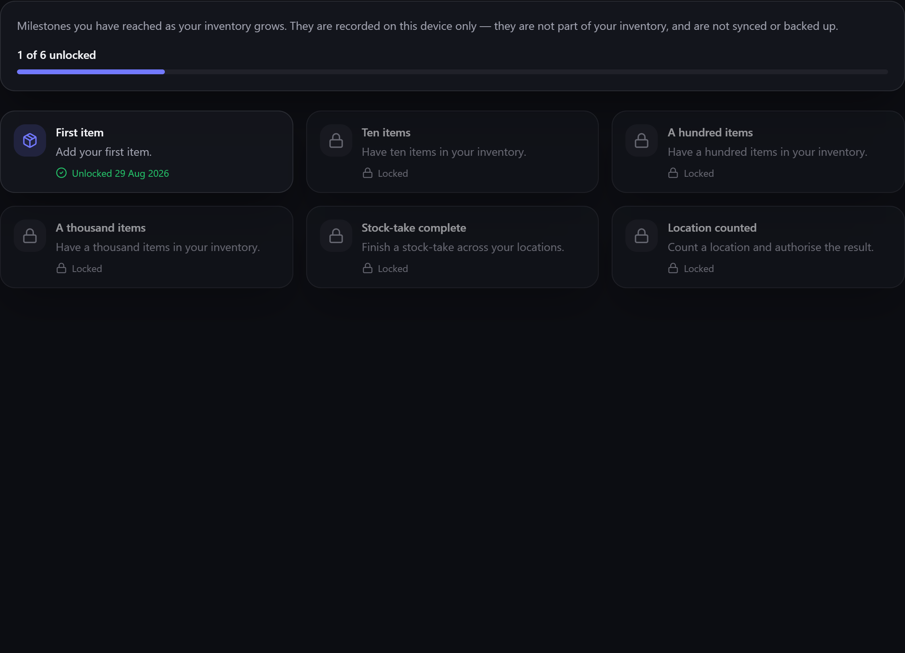

# Achievements

**Achievements** are small milestones Gubbins marks as your inventory grows — your first item, your
hundredth, your first completed stock-take. The **Achievements** screen shows all of them, so you
can see what you've reached and what's still ahead.

**Where to find it:** the **View achievements** button on the [[About|About-and-Diagnostics]]
screen, or type "Achievements" into the [[command palette|Command-Palette-and-Shortcuts]].

## What's on the screen

A card for every achievement, whether you've earned it or not:

- **Unlocked** cards show the date you earned it. An achievement Gubbins recognised only after the
  fact — because you were already past it when the screen arrived — says just **Unlocked**, with no
  date, rather than claiming a day it can't know.
- **Locked** cards are dimmed and carry a padlock. The description says what earns it, so the
  screen doubles as a list of what's left.

A counter at the top says how many of the total you've unlocked.

## Earning one

Most achievements come to you — nothing needs turning on, and there's nothing to claim. When you
cross a milestone a message names what you've unlocked.

| Achievement | How it's earned |
| --- | --- |
| First item | Add your first item. |
| Ten items | Have ten items in your inventory. |
| A hundred items | Have a hundred items in your inventory. |
| A thousand items | Have a thousand items in your inventory. |
| Stock-take complete | Finish a [[stock-take\|Cycle-Counts-and-Audit-Day]] across your locations. |
| Location counted | Count a location and authorise the result. |

The item counts include **archived and inactive** items, so they reflect everything you've ever
added rather than only what's on the shelf today.

> **ℹ️ Note**
> Deleting items never takes an achievement away. Once it's earned it stays earned — emptying your
> inventory and starting again won't award it a second time either.

> **⚠️ Heads-up**
> Achievements are recorded **on this device only**. They aren't part of your inventory, so they
> aren't [[synced|Cloud-Sync]], aren't included in a [[backup|Backup-and-Restore]], and a different
> browser or device starts its own record. The **Drafts & reminders** target in the
> [[Danger Zone|Danger-Zone-Erasing-Data]] clears them along with this device's other local odds
> and ends.

A milestone can also arrive with a short burst of fireworks, but only at the liveliest
[[Animation|Appearance-and-Theming]] level — the default setting keeps that flourish off, as does
your system's reduced-motion setting. The message appears either way, so you never miss the moment.
