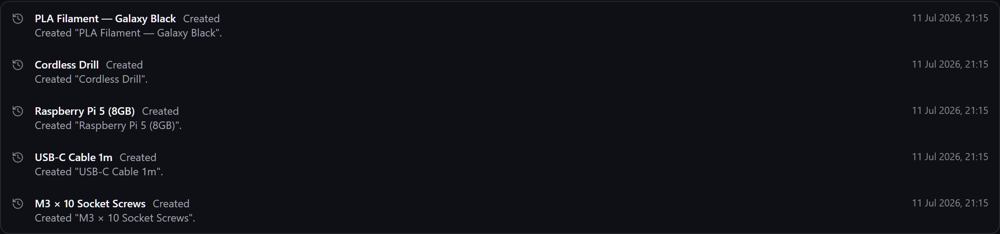

# Activity log

Gubbins keeps a **chronological ledger of every change** to your inventory — what happened, to
what, and when. It's your audit trail and your undo-history-of-record.

**Where to find it:** the **Activity** screen (a global feed), and the **Activity** tab on any
individual item.

## What gets recorded

Just about every meaningful change is logged: creating and editing items, stock adjustments,
[[moves and transfers|Locations-and-Stock]], [[loans out and returns|Loans-Check-Out-and-In]],
[[sales and write-offs|Sales-and-Disposals]], [[cycle-count reconciliations|Cycle-Counts-and-Audit-Day]],
revaluations, servicing, and more.

Every entry is also recorded against **who** made it. On a single-person setup that's always the
built-in **Admin** account, so it isn't something you need to think about. Turn on
[[accounts|Users-and-Accounts]] and each entry carries the name of the person who made the change
instead.

- The **global Activity feed** shows everything across your inventory, newest first.
- Each **item's Activity tab** shows just that item's history — a complete story of one thing.

Editing an item's details is recorded too, as a single **Details changed** entry naming what you
changed: its price (unit cost, purchase price or current value), barcode, serial number,
manufacturer and manufacturer part number, category, batch and lot numbers,
[[reorder thresholds|Low-Stock-and-Gauges]], expiry, acquisition and warranty dates, depreciation
period, weight and dimensions — alongside the renames, tracking-mode switches and condition changes
that have always been logged.

> **ℹ️ Note**
> A few things change quietly. The free-text description, notes and **operational parameters** do,
> because keeping a copy of long text on every edit would bloat a log that syncs to your other
> devices — as do [[custom-field values|Custom-Fields-and-Capabilities]]. So do the **favourite**
> pin and the dead-stock and unlimited-supply toggles, which are display and reporting preferences
> rather than changes to what the item is. Saving a form without actually changing anything records
> nothing at all.

## A location's own history

Locations keep a record too, separate from the items inside them. Open a location's **Edit** dialog
and pick the **History** tab to see it.

It covers the changes that reshape where things live — the ones that are hardest to explain after
the fact:

- the location being **created**;
- a **rename**, showing the name before and after;
- a **move** under a different parent (or out to the top level), naming both;
- **archiving** and **restoring** it;
- **deleting** it, noting how many items went to Unassigned and how many sub-locations were moved
  up — and the sub-locations themselves each record the move, so a shelf that ends up somewhere
  new because the room above it was deleted says so.

Everything else about a location — its colour, type, capacity, dimensions, walk order, the default
flag and the dead-stock setting — describes the place rather than the shape of your storage, so it
isn't recorded. Nor is a save that didn't actually change anything.

> **ℹ️ Note**
> Deleting a location doesn't erase its record. The entries are kept with the name the place had, so
> a deletion still travels to your other devices and still appears in a backup — even though there
> is no longer a location to open and read it in.

> **💡 Tip**
> The Activity log is the fastest way to answer *"what changed, and when did that happen?"* — if a
> count looks wrong, its item's history usually shows exactly what led to it. For *"why is this
> shelf suddenly under a different room?"*, it's the location's own **History** tab you want.

> **ℹ️ Note**
> The log can grow large over time. If you need to reclaim space, old history can be pruned (with
> a cold-storage export first) from the [[storage triage|Storage-Triage]] tools — nothing is lost
> without a copy.

## Exporting a log

**Export** saves a log as a spreadsheet or a table — handy for an audit trail, a handover, or
working out where a month's stock went. It sits on the Activity screen for the whole-inventory
feed, and above an item's own **Activity** tab for just that item.

Either way the file covers the **whole** log — the global feed under whichever kinds you have
selected, or every entry for the item — not just what is on screen. The usual formats are offered:
CSV, TSV, an Excel workbook, JSON, Markdown, printable HTML or plain text. See
[[Export & import|Export-and-Import]].

## Clearing an item's log

**Clear log**, above an item's **Activity** tab, empties that item's history. It is not a hard
delete of everything: one entry is left in place recording that the log was cleared, when, and by
whom — the signed-in person if you use [[accounts|Users-and-Accounts]], or a short marker for the
device it was done on if you don't.

The item itself is untouched. Its stock, photos, custom fields and everything else stay exactly as
they were; only the record of how it got there goes.

Reports that read the log adjust accordingly. [[Dead-stock detection|ABC-Turnover-and-Aging]] counts
an item's idle time from its last recorded movement, so once that record is gone it counts from the
clear instead — the item starts fresh rather than being reported as idle since the day you added it.

> **⚠️ Heads-up**
> Clearing cannot be undone, and it travels: your other devices drop the same entries on their next
> [[sync|Cloud-Sync]]. Take an **Export** first if there is any chance you will want the history
> later. If you only want to reclaim space, prune old history from the
> [[storage triage|Storage-Triage]] tools instead — that keeps a cold-storage copy.

> **ℹ️ Note**
> Clearing is only offered to someone allowed to delete audit records. With
> [[accounts|Users-and-Accounts]] switched off that's everyone, as usual; with them on, a role
> without that permission sees the log and its Export button but no Clear.

## Related pages

- **[[Alerts]]** — things that need action now.
- **[[Export & import|Export-and-Import]]** — saving the log to a file.
- **[[Upcoming agenda|Upcoming-Agenda]]** — things due soon.
- **[[Storage triage|Storage-Triage]]** — managing history size.
- **[[Locations & stock|Locations-and-Stock]]** — the hierarchy a location's own history records.
