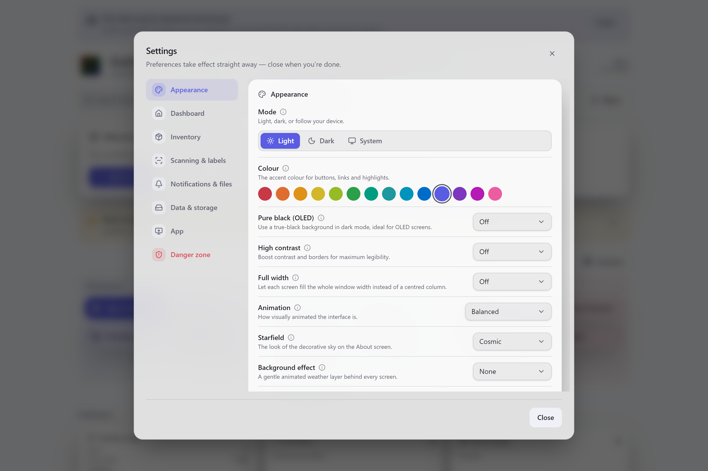
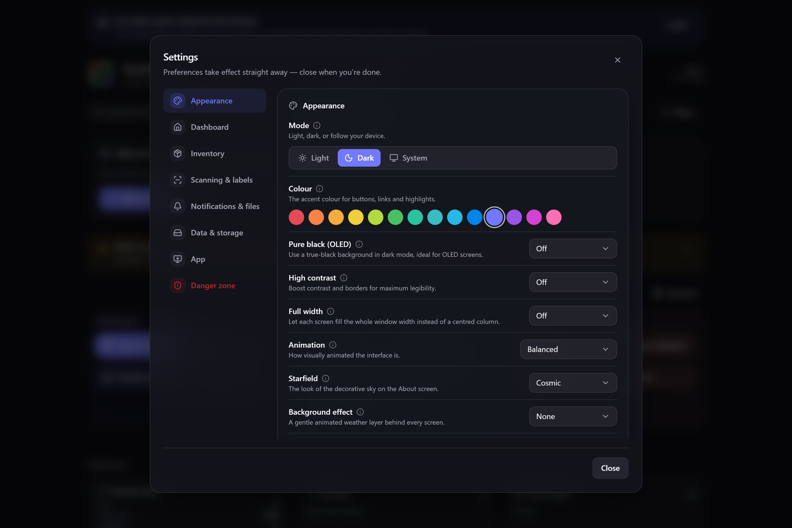

# Appearance & theming

Gubbins can look the way you want it to. Theming is built from two independent choices — a
**mode** (light or dark) and an **accent colour** — plus a set of switches for contrast,
motion and decorative flair.

**Where to find it:** **Settings → Appearance**.

## Mode: light, dark or system

- **Light** — a bright palette for well-lit rooms.
- **Dark** — the deep, low-glare default.
- **System** — follow your device and switch automatically when it does (for example, at
  sunset).

Your accent colour applies in **either** mode, so you don't have to re-pick it when you switch.

## Colour (accent)

The **accent** is the colour used for buttons, links and highlights. Pick from the row of
swatches — surfaces stay neutral, so only the accent changes. It's tuned to look right in both
light and dark mode.

## Contrast & legibility

- **Pure black (OLED)** — drops dark-mode surfaces to true black, which lets an OLED display
  switch those pixels fully off (deeper blacks, less power). Only affects dark mode.
- **High contrast** — an accessibility mode that raises contrast and strengthens borders across
  the whole app. Works in both light and dark mode.

> **💡 Tip**
> Pure black and High contrast stack with any accent colour, so you can have, say, a
> high-contrast dark theme with a teal accent.

## Full width

By default every screen sits in a centred column with margins either side, which keeps lines
comfortable to read on a typical display. Turn **Full width** on and each screen stretches to
fill the whole window instead — handy on a wide monitor, where you get more items across, wider
tables and roomier detail views. It's **off** by default; switch it back any time for the
calmer centred layout.

## Motion & decorative flair

Gubbins has some gentle visual polish that you can dial up or down:

- **Animation** — how animated the interface is, from calm to lively.
- **Background effect** — an optional soft animated layer behind every screen.
- **Starfield** — the look of the decorative sky on the [[About|Introduction]] screen.
- **Holographic foil cards** / **Collector cards** — playful trading-card shimmer and rarity
  frames on item cards.

> **ℹ️ Note**
> All decoration respects your system's **reduced-motion** setting — if you've asked your
> device to minimise animation, Gubbins honours that automatically, whatever these are set to.

> **💡 Tip**
> Want a calmer app in one move? Turning **Animation** down (or enabling your device's
> reduce-motion setting) quiets every decorative effect at once.

## Related pages

- **[[Dashboard & widgets|Dashboard-and-Widgets]]** — arranging your landing screen.
- **[[Language & region|Language-and-Region]]** — language, currency and date formats.
- **[[Kiosk & tablet mode|Kiosk-and-Tablet-Mode]]** — a locked-down, always-awake display.
- **[[Modular UI|Modular-UI]]** — hiding features you don't use.
