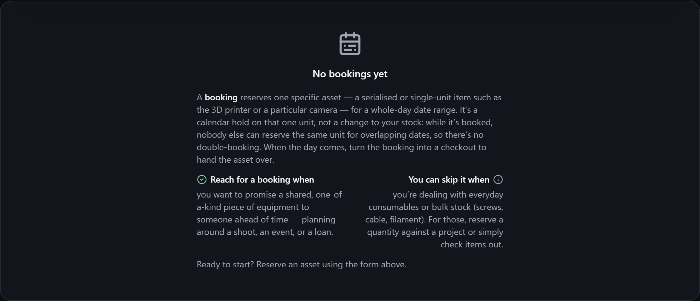

# Bookings

A **booking** reserves an item for a [[contact|Contacts]] over a **date range** — ahead of time,
before they take it. Perfect for shared equipment, hire kit, or anything several people want on
different days.

**Where to find it:** the **Bookings** screen (in the menu, when the module is enabled).

## Reserving an item

Create a booking for an item, choose the contact, and set a **start and end date**. The item is
now spoken for over that window — a plan for the future, distinct from a
[[loan|Loans-Check-Out-and-In]] (which is stock that's *out right now*).

Bookings are grouped by status — upcoming, active, overdue and so on — with a count beside each
heading. The screen reads as many bookings as it can at once; if you have more than that, it says
so beneath the form rather than quietly showing you part of the picture. Cancelling or deleting
bookings you've finished with keeps the list to a useful length.

## Overlap detection

Gubbins checks for **clashes**: if you try to book an item that's already reserved for an
overlapping period, it tells you — so two people can't unknowingly claim the same thing on the
same day.

> **ℹ️ Note**
> If two devices are offline and each books the same asset for overlapping dates, they can't see
> each other's reservation at the time. When they next [[sync|Cloud-Sync]], Gubbins keeps the
> booking made **first** and cancels the later clashing one — see
> [[Cloud sync → overlapping bookings|Cloud-Sync]].

> **💡 Tip**
> Bookings turn Gubbins into a simple shared-equipment scheduler. Reserve the good camera for a
> shoot next week, and anyone else booking it sees it's taken.

## Bookings in your agenda

Upcoming bookings and their return dates appear in the [[Upcoming agenda|Upcoming-Agenda]], so a
reservation coming up (or an item due back) is never a surprise. Bookings can also be surfaced to
your calendar via the [[iCal feed|Webhooks-MQTT-and-iCal]].

> **ℹ️ Note**
> A **booking** is a future reservation; a **[[loan|Loans-Check-Out-and-In]]** is an item that's
> physically out now. A booking typically becomes a loan when the contact actually collects the
> item.

## Related pages

- **[[Loans|Loans-Check-Out-and-In]]** — checking a reserved item out when it's collected.
- **[[Contacts]]** — who a booking is for.
- **[[Upcoming agenda|Upcoming-Agenda]]** — bookings alongside everything else due.
