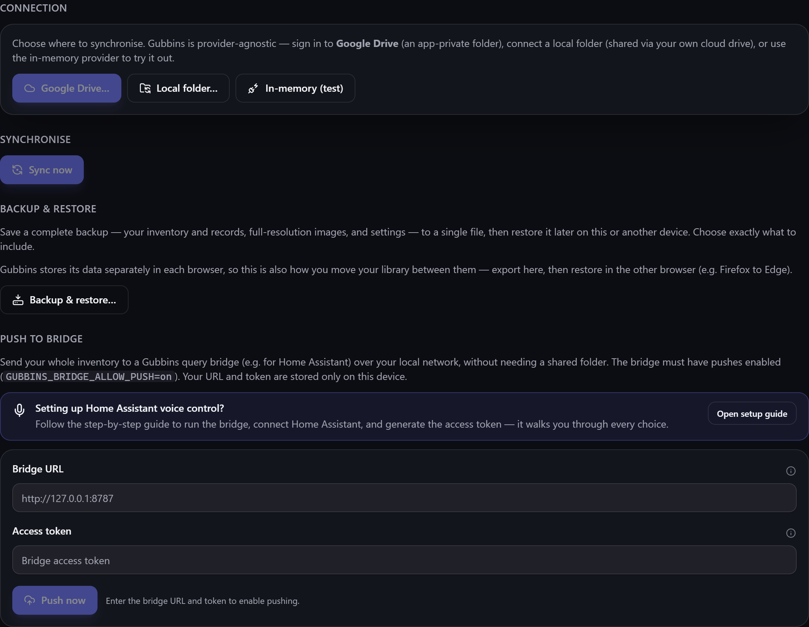

# Cloud sync

Use Gubbins on more than one device? **Cloud sync** keeps them in step — through storage **you
own and control**, not a Gubbins server. There is no Gubbins account and no Gubbins backend; sync
goes through *your* folder or *your* drive.

**Where to find it:** the **Sync** screen (in the menu, when the module is enabled).

## Where sync happens

Gubbins is **provider-agnostic**. You choose where the shared copy lives:

- **A local folder** — via your browser's **File System Access**, sync through a folder that's
  itself synced by Dropbox, OneDrive, a NAS, or similar.
- **Google Drive** — a backend-less, in-browser sign-in that stores the data in an
  **app-private** folder on your own Drive.

Each device reads and writes the shared copy, so your inventory follows you between them.

> **ℹ️ Note**
> The **Google Drive** option only appears if whoever built the copy of Gubbins you're using
> configured it with a Google sign-in identifier. If you don't see it, that build didn't include
> one — the local-folder option and [[backups|Backup-and-Restore]] work regardless.

## How conflicts are handled

When two devices change things independently, Gubbins reconciles **per item, per field** — not as
one big all-or-nothing overwrite. If you edit one thing on your phone while another device edits
something *else*, both changes are kept. It's **only** when the *same* field of the *same* thing is
changed on two devices before they sync that Gubbins has to pick one, and it does so with
**last-write-wins** — the most recent change prevails — so syncing is safe without you refereeing
every difference.

### When two devices create the same thing

Some things are identified by their **name** rather than by which device made them — tags,
contacts, and custom fields. If you add a tag called *Bolts* on your phone while your laptop is
offline, and the laptop adds its own *Bolts* too, syncing does **not** leave you with two
identical tags: Gubbins recognises them as the same thing and merges them into one.

Nothing is lost in the merge. The surviving tag carries **both** devices' items, a merged contact
keeps the checkout history from either side, and a merged custom field keeps the values recorded on
both. The same applies to a value entered twice for one field, or a specification added to the same
item on two devices — the more recent entry is kept, by the same last-write-wins rule as above.

> **ℹ️ Note**
> Matching ignores capitalisation, so *Bolts* and *bolts* are treated as one name — exactly as they
> are when you type a duplicate on a single device.

### Reviewing overwritten edits

Last-write-wins means one side's change to that same field is set aside. So you never lose that
work silently, Gubbins **notices** when an edit *you* made since your last sync is overwritten this
way and lists it for you.

When it happens, a **Conflicts** section appears on the Sync screen. Open **Review…** to see each
one side by side — your version next to the version that was kept — and choose:

- **Keep current** — accept the version that won; the note is cleared.
- **Use my version** — put *your* edit back. It syncs to your other devices on the next sync.

The same applies if another device **deleted** something you'd just edited: it's listed so you can
restore your version instead of losing it.

> **ℹ️ Note**
> This review list is **per device** — it shows the edits *this* device lost. Only genuine
> same-field clashes appear; a device simply catching up on newer changes is not a conflict and is
> never listed.

## When the shared copy can't be read

Your devices meet through a single **shared copy** of your inventory — a file in the folder or
Drive account you connected. Sometimes it can't be read at the moment you sync: your cloud tool
may still be downloading it, another device may be part-way through writing it, or you may have
reconnected the wrong folder or account.

Gubbins **stops** the sync and tells you, rather than pressing on. This matters because carrying on
would mean uploading *this* device's inventory as the shared copy — and anything that existed only
on your other devices would be gone from it. Waiting a moment and syncing again is almost always
all that's needed.

If the shared copy has genuinely disappeared — you emptied the folder, or deleted the file — the
message offers **Publish this device's data**, which starts a new shared copy from what's on this
device. Use it only when you're sure: it can't bring back records that lived solely on the other
devices.

> **💡 Tip**
> Before publishing a fresh shared copy, sync your *other* devices first if you can, or take a
> [[backup|Backup-and-Restore]] from them. That way the new shared copy starts complete.

> **💡 Tip**
> The local-folder option is the most flexible: point it at any folder your existing cloud tool
> already syncs, and Gubbins rides on top of the service you already trust.

> **ℹ️ Note**
> Sync moves your data through storage *you* control. Gubbins never sees it — there's no server in
> the middle. The Google Drive option uses Google's own sign-in and stays within an app-private
> folder. See [[Privacy & security|Privacy-and-Security]].

## Sync vs backup

> **ℹ️ Note**
> **Sync** keeps devices *continuously* in step. A **[[backup|Backup-and-Restore]]** is a
> *point-in-time* copy you can restore from. They complement each other — sync for day-to-day,
> backups for safety and history.

## Related pages

- **[[Backup & restore|Backup-and-Restore]]** — point-in-time copies.
- **[[How your data is stored|How-Your-Data-Is-Stored]]** — the local-first model.
- **[[Storage triage|Storage-Triage]]** — keeping storage healthy.
