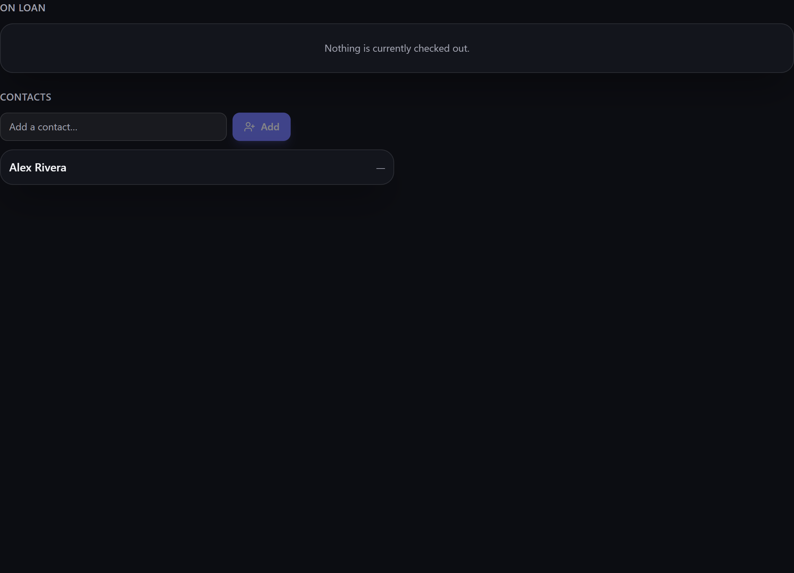

# Contacts

**Contacts** are the people and organisations your inventory touches — the folks you **lend to**
and **borrow from**. They tie loans and bookings together.

**Where to find it:** the **Contacts** screen (in the menu, when the module is enabled).

## What a contact is for

A contact is a lightweight record of a person or organisation. Once you have one, it becomes the
*who* behind several features:

- **[[Loans|Loans-Check-Out-and-In]]** — check items out to a contact and track what they have.
- **[[Bookings|Bookings]]** — reserve items for a contact over a date range.

The Contacts screen shows what each person currently holds on loan, so you can see at a glance who
has what. The **overdue** badge beside the **On loan** heading counts every late loan you have,
however many there are, rather than only the ones the list has room for. If there are more loans
than the list can show at once, it shows the ones due soonest and says how many are left over;
**Export** beside the heading still saves the lot.

If you build up a lot of contacts, the list splits into pages using the same
[[pagination control|Inventory-Views]] as the rest of the app — turn it on with **Paginate list**
(or **Settings → Inventory → Lists**), and every contact stays reachable however many you have.
With it off, the list shows as many as it can read at once and tells you how many are left over.

> **ℹ️ Note**
> Purchasing doesn't draw on contacts. [[Purchase orders|Purchase-Orders]] and
> [[supplier parts|Supplier-Parts-and-Price-History]] record a supplier's name directly, so adding
> a supplier as a contact won't make it appear in those screens.

> **💡 Tip**
> You don't have to create contacts up front. When you [[check an item out|Loans-Check-Out-and-In]]
> to someone new, Gubbins can create the contact on the spot — so the list builds itself as you go.
> Names are matched **ignoring case, in any language**, so typing `café ltd` reaches the `Café Ltd`
> you already have rather than filing a second record beside it — and the same name in different
> capitalisation is refused if you add it from the Contacts screen.

> **ℹ️ Note**
> Contacts are ordinary data on your device. Keep only what you need, and remember the repository
> and any [[backups|Backup-and-Restore]] are yours alone — Gubbins never shares them. See
> [[Privacy & security|Privacy-and-Security]].

> **💡 Tip**
> Each of the screen's two lists exports on its own: **Export** beside **On loan** saves who has
> what and when it's due, and **Export** beside **Contacts** saves the address book with each
> person's open-loan count. Both cover the whole list, not just the page on screen. See
> [[Export & import|Export-and-Import]].

## Related pages

- **[[Loans|Loans-Check-Out-and-In]]** — lending items to a contact.
- **[[Export & import|Export-and-Import]]** — saving contacts or loans to a file.
- **[[Bookings|Bookings]]** — reserving items for a contact.
