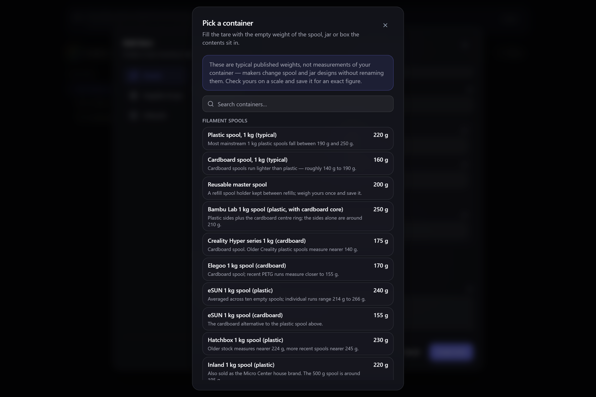

# Container weights (tare)

Whenever you weigh something, you're also weighing whatever it's sitting in — the spool, the jar,
the tray. That empty weight is called the **tare**, and Gubbins subtracts it to get at what you
actually care about. The container library saves those weights so you pick a container instead of
remembering the number.

**Where to find it:** the **Pick a container…** button beside any **Tare** or **Container weight**
field.

## Why it matters

A 3D-printer filament spool weighs a couple of hundred grams empty. Put a half-used spool on a
scale and roughly a quarter of the reading is plastic you'll never print. Tell Gubbins what the
empty spool weighs and it can turn a single weigh-in into "412 g of filament left" instead of a
number you have to do arithmetic on. The same applies to a jar of flour, a bin of screws, or any
container you weigh more than once.

## Picking a container

**Pick a container…** opens the library. Search by brand, material or kind — `polymaker
cardboard`, `esun`, `jar` — and choose an entry; its weight drops into the field, and everything
after that behaves exactly as if you'd typed the figure yourself.

The library is grouped by kind: filament spools, jars, bins and boxes, trays, and anything else
you've saved.

> **⚠️ Heads-up**
> The built-in weights are **typical published figures, not measurements of your container.**
> Manufacturers change spool and jar designs without renaming the product — the same brand can
> vary by 100 g between production runs, and cardboard and plastic versions of one spool are
> nothing alike. Treat a built-in entry as a starting point and check it on a scale.

Each entry says what was actually measured, so you can judge how much to trust it — whether a
figure is an average across ten spools or a single sample, and whether a lighter cardboard version
exists.

## Saving your own

The reliable answer is always your own scale, so saving a container is a first-class action rather
than an afterthought.

Take the container off the scale empty, note the reading, and choose **Save a container of your
own…**. Give it a name you'll recognise (`Flour jar`, `Blue parts tray`), pick a kind, and enter
the weight. If the field you're filling already has a figure in it, the form starts pre-filled
with it — so "I just weighed this, keep it" is a name and a button.

Saved containers appear **above** the built-in catalogue and are marked **Yours**, because a
container you measured yourself beats any published figure.

## Changing or removing one of your containers

Your own containers stay yours to correct. Every entry marked **Yours** carries an **edit** and a
**delete** button beside it in the picker:

- **Edit** reopens the form over that container, pre-filled with its current name, kind and empty
  weight. Change what you need and choose **Save changes** — you stay in the library rather than
  the picker closing, since correcting an entry isn't the same as choosing one. Reweighed the jar
  after a chip came off the rim? This is where that goes.
- **Delete** asks first, then removes the container from your library.

> **ℹ️ Note**
> Editing or deleting a container only changes the library. A tare figure you've already put into
> an item or a gauge keeps the value it was given — Gubbins copies the number in when you pick a
> container, it doesn't leave the field pointing at the entry. If you correct a container's weight
> and want an existing item to match, pick the container again on that item.

Built-in catalogue entries have no edit or delete button. They're the shipped reference list, not
your data — if one doesn't match the container in your hand, weigh yours and save it, and your
entry sorts above the built-in anyway.

> **💡 Tip**
> Saved containers travel with your data. They're included in [[cloud sync|Cloud-Sync]] and
> [[backups|Backup-and-Restore]], so a jar you weighed on the kitchen tablet is there on the
> workshop desktop too.

## Where containers can be used

The library appears anywhere Gubbins asks for a tare:

- **[[Consumable gauges|Low-Stock-and-Gauges]]** — the empty spool or bottle a gauge's contents
  sit in, set when you create the item and editable afterwards.
- **[[Counting by weight|Counting-by-Weight]]** — the tray or bag a handful of parts is weighed
  in.

> **ℹ️ Note**
> A gauge measured in something other than weight — a cable reel in metres, a tank in millilitres
> — has no **Pick a container…** button. A container weight would be meaningless there, so Gubbins
> doesn't offer one rather than filling the box with a plausible-looking wrong number.

Weights are shown and entered in whatever [[weight unit|Units-of-Measure]] you've chosen; Gubbins
stores them in one canonical unit behind the scenes, so changing the setting never alters a saved
container.

## Related pages

- **[[Counting by weight|Counting-by-Weight]]** — counting small parts on a scale.
- **[[Low stock & gauges|Low-Stock-and-Gauges]]** — weighing a consumable to gauge what's left.
- **[[Items]]** — where an item's own weight is recorded.
- **[[Units of measure|Units-of-Measure]]** — choosing your weight unit.
- **[[Cloud sync|Cloud-Sync]]** — keeping saved containers across devices.
