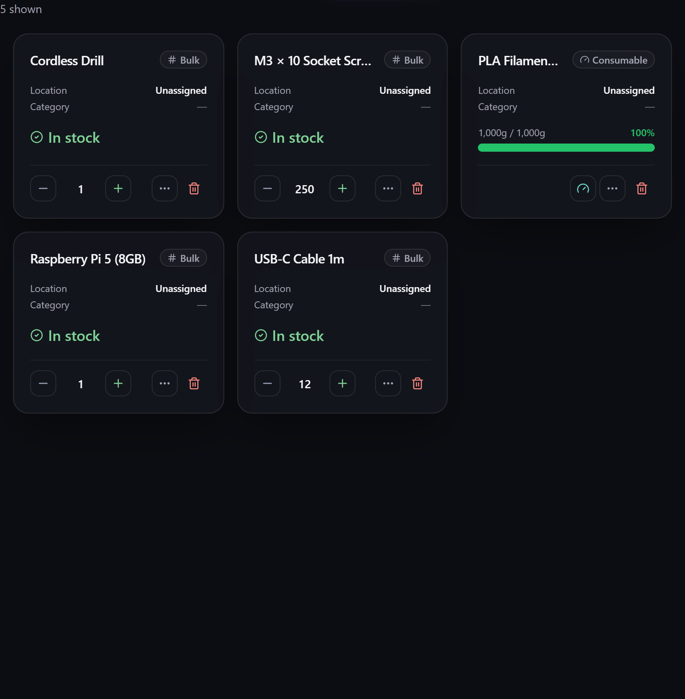
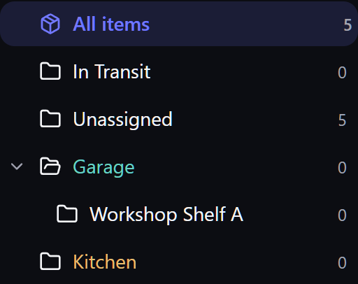

# Core concepts

Almost everything in Gubbins is built on four ideas: **items**, **locations**, **stock**, and
**tracking modes**. Understand these and the rest of the app falls into place.

## Items

An **item** is a *kind of thing* you're tracking — "M3 × 10 socket screws", "Cordless drill",
"PLA filament". It is not one physical unit but the record that represents that thing: its
name, photo, category, price, custom fields, and how many you have.

Each item is shown as a card (or a row, in denser views — see [[Inventory views|Inventory-Views]]).
A card carries the item's name, its tracking style, where it lives, its stock status, and a
quick way to adjust the count.

There's a lot an item *can* hold — categories, [[custom fields & capabilities|Custom-Fields-and-Capabilities]],
[[tags & attachments|Tags-Attachments-and-Related-Items]], [[warranty|Warranty-and-Depreciation]],
[[maintenance schedules|Maintenance-and-Servicing]] — but none of it is required. Start with a
name and add depth only where it earns its keep. The full field list is on the [[Items]] page.

## Locations

A **location** is *where an item lives* — a room, a shelf, a drawer, a toolbox. Locations are
**hierarchical**: a *Garage* can contain *Shelf A*, which can contain *Bin 3*. They can be
colour-coded and described, and each shows how many items it holds.

Selecting a location filters the inventory to just what's in it (and everything nested
beneath it). **All items** clears the filter.

## Stock — the per-location ledger

**Stock** is *how many* of an item you have. The important idea is that stock is tracked
**per location**: 200 screws on *Shelf A* and 50 in the *Kitchen* are the same item with a
combined on-hand of 250, but Gubbins remembers the split. **Transfers** move quantity from one
location to another without changing the total.

> **ℹ️ Note**
> An item's total quantity is always the sum of its per-location stock. You adjust stock where
> it physically is, and the total keeps itself correct.

For finer tracking, stock can be broken down further into [[batches & lots|Batches-and-Lots]]
(with expiry dates) beneath each location.

## Tracking modes

Not everything is counted the same way. An item's **tracking mode** decides how its quantity
behaves:

| Mode | Best for | How it counts |
| --- | --- | --- |
| **Bulk** | Loose, interchangeable stock (screws, cable, resistors) | A single number you increase and decrease. |
| **Serialised** | Individually identified units (tools, devices) | Each unit is tracked separately, by serial number. |
| **Consumable** | Things measured by how *full* they are (filament, solder, liquids) | A gauge between empty (tare) and full capacity. |
| **Untracked** | Things you list but don't count | No quantity at all. |

The full explanation, with when to use each, is on [[Tracking modes|Tracking-Modes]].

## How it all fits together

> An **item** is tracked using a **tracking mode**; its **stock** sits in one or more
> **locations** (optionally split into **batches**); and everything you *do* to it — adjusting
> a count, moving it, lending it out — is recorded in its [[activity log|Activity-Log]].

From here you can go deeper on any concept:

- **[[Items]]** — every field an item can hold.
- **[[Tracking modes|Tracking-Modes]]** — Bulk vs Serialised vs Consumable vs Untracked.
- **[[Locations & stock|Locations-and-Stock]]** — hierarchy, transfers and the ledger.
- **[[Glossary]]** — a quick reference for every term used in the app.
