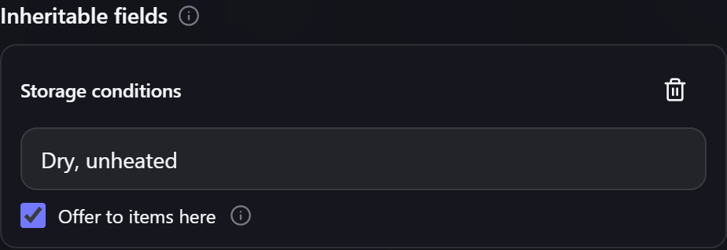
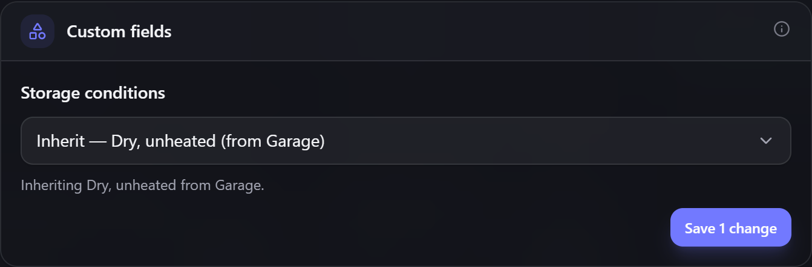

# Custom fields & capabilities

Gubbins' built-in fields cover the basics, but every collection has its own attributes. **Custom
fields** and **capabilities** let you record — and search on — exactly the properties that matter
to *your* inventory.

**Where to find it:** the **Classification** tab of an item's details, once the **Custom fields &
capabilities** capability is enabled ([[Modular UI|Modular-UI]]).

## Custom fields

A **custom field** adds your own labelled value to an item — `Voltage`, `Material`, `Location
code`, `Author`, whatever your domain needs. Custom fields are typically defined per
**category**, so every item in that category shares the same set.

You can [[search|Text-Query-Syntax]] on them with the `field:` prefix:

```
field:material=steel
```

> **💡 Tip**
> Because custom fields hang off a **category**, setting a category up once gives every item in
> it the right fields automatically — no need to re-add them item by item.

### One field, shared everywhere

A field is identified by its **name**. If two categories both define `Manufacturer`, they are
the same field — not two fields that happen to look alike. That's what lets a value set on a
[[location|Locations-and-Stock]] reach items in either category, and it means renaming
`Manufacturer` to `Brand` renames it everywhere at once.

Two consequences worth knowing:

- You can't define the same name twice with **different types** — if `Rating` already exists as
  a text field, adding a number field called `Rating` is refused. Pick a different name.
- Changing a field's **type** is only allowed while a single category uses it. If others share
  it, Gubbins refuses rather than silently reinterpreting the values stored under them.

Whether a field is **required**, its **default value** and its **position** stay per-category —
so `Manufacturer` can be required for Power tools and optional for Spares.

### Inheriting a value from a location

Instead of typing the same value onto every item in a drawer, you can set it **once on the
location** and let the items take it.

Open a location's **Edit** dialog and find **Inheritable fields**. Add a field, give it a value,
and tick **Offer to items here**. Any item in that location — or in any location nested inside
it — can then pick up that value.



On the item, the field grows a small chooser above it:

- **Inherit — *value* (from *location*)** — take the location's value.
- **Set a value for this item** — enter your own, exactly as before.



Inheriting is **opt-in per item and per field**: nothing changes on existing items until you
choose it. The chooser only appears when a location above the item actually offers that field.

> **💡 Tip**
> Inherited values are *live*. Change the value on the location and every item inheriting it
> follows immediately — no re-editing. Move an item to a different location and it picks up
> that location's value instead.

When locations are nested, the **nearest one wins**: if `Workshop` offers `Manufacturer =
Ryobi` and `Workshop → Cabinet A` offers `Makita`, an item in Cabinet A inherits Makita.

Inherited values behave like any other for [[search|Text-Query-Syntax]] — `field:manufacturer=ryobi`
finds items that inherit Ryobi just as it finds items that store it.

> **ℹ️ Note**
> Ticking **Offer to items here** is deliberately separate from setting the value. A location
> can record a detail about *itself* — a shelf's load rating, a room's humidity — without every
> item inside quietly adopting it.

If a location stops offering a field (you untick the box, clear the value, or move the item
elsewhere), items that were inheriting fall back to the category default. Your choice to inherit
is remembered, so restoring the value on the location restores the inheritance too.

### Adding a field note

When you define a custom field you can give it an optional **Description** — a short note about
what the field is for. If you fill it in, an **(i)** info badge appears next to that field on
every item in the category; hovering or focusing it shows your note. It's the ideal place for a
reminder such as *where to read the value from*, *which units to use*, or a link to a reference.
The note supports Markdown, and leaving it blank simply hides the badge.

### Starting from a preset

Rather than adding fields one at a time, the category manager's **Add from a preset** picker
creates a ready-made category with a curated set of custom fields already attached — covering
maker and hobbyist staples like `Battery`, `Cable`, `Electronic component`, `Fastener`,
`3D Filament`, `Fabric`, `Paint`, `Adhesive` and `Model kit`, plus a large library of collector
staples spanning cards and coins (`Trading card`, `Baseball cards`, `Magic: The Gathering cards`,
`Coin`, `Banknote`), media (`Book`, `Vinyl record`, `DVDs`, `Blu-rays`, `Video games (physical)`,
`Vintage movie posters`), timepieces and jewellery (`Luxury watches`, `Mechanical wrist watches`,
`Handbags`, `Gold & silver bullion`), toys and figures (`Action figures`, `Funko Pop figures`,
`LEGO sets`, `Die-cast model cars`, `Warhammer & tabletop gaming miniatures`), and antiques and
curios (`Antique furniture`, `Porcelain & fine ceramics`, `Vintage cameras`, `Fountain pens`,
`Stamps`, `Postcards`) — among many others. Pick one, then rename, extend or trim its fields to
match your own inventory.

The picker is organised for browsing: sections down the left-hand side — **Workshop**,
**Electronics**, **Household**, **Crafts & hobbies**, **Media** and **Collectibles**, plus
**All presets** for the whole library at once — and, on the right, the presets of the chosen
section. Each preset shows its name, a one-line description and a sample of the custom fields
it creates, so you can see what you're getting before you add it.

A **search box** above the sections filters the library as you type, matching preset names,
descriptions and field names alike — so `isbn` finds the `Book` preset and `expiry` finds
`Food` and `Adhesive`. While you're searching, each section shows how many of its presets
match. Press the **✕** button — or **Escape** while typing in the search box — to clear the
search; pressing **Escape** anywhere else (or with the search box empty) closes the picker.

> **ℹ️ Note**
> A preset whose category already exists is marked **Added** and can't be imported twice, so
> there's no risk of duplicates.

### Giving a category a glyph

A category can carry an optional **glyph** — a single emoji such as 🔋 for batteries, 📖 for
books or 🛠️ for tools. Open **Categories & schemas**, pick the category, and use the **Glyph**
field to choose one; the built-in presets each come with a fitting glyph already set.

When a category has a glyph, every item in it shows that glyph as a large, faint **greyscale
watermark** in the bottom-right corner of its card in the [[Visual view|Inventory-Views]] — a
quick at-a-glance cue for what kind of thing each card is. The watermark is always drawn in
greyscale at a low opacity, so it reads as a background texture rather than competing with the
item's details.

Choosing a glyph opens a **glyph browser**: a list of groups down the left (Smileys, People,
Animals & nature, Food & drink, Objects, Symbols and more) with a **search box** above them that
filters every glyph as you type — search by name or by what it means (`car`, `screw`, `battery`).
The grid on the right shows the chosen group, or your search matches. Pick a glyph with the
mouse, or move through the grid with the **arrow keys** and press **Enter**; press **Escape** to
clear the search, or again to close. The browser can be resized by dragging its corner, and it
remembers the size you set.

> **💡 Tip**
> Prefer a cleaner grid? Turn all category watermarks off in one place under **Settings → Item
> cards → Category watermarks** — that hides every watermark without clearing any category's
> glyph, so you can switch them back on any time.

## Capabilities

A **capability** is a *weighted* attribute — a property an item **has**, optionally with a
numeric value. Think `waterproof`, `voltage = 3.3`, `torque = 40`. Capabilities power Gubbins'
smartest searches:

- **Presence** — "items that are `waterproof`" (`cap:waterproof`).
- **Comparison** — "items with `voltage` over 3.3" (`cap:voltage>3.3`).
- **Best-match ranking** — when several items match, the ones whose capability is a *better* fit
  rank first, so the closest match rises to the top.

> **💡 Tip**
> Capabilities are ideal for *"find me something that can do X"* searches — the part with enough
> current rating, the tool with the right reach. Give the capability a value and let ranking
> surface the best option.

## Custom fields vs capabilities

> **ℹ️ Note**
> - A **custom field** records a fact *about* an item you want to store and display
>   (`Material = steel`).
> - A **capability** describes what an item *can do* and is built for ranked, comparative search
>   (`voltage ≥ 3.3`).
>
> Many items need only one or the other; use whichever matches how you'll look things up.

## Related pages

- **[[Search overview|Search-Overview]]** and **[[Text query syntax|Text-Query-Syntax]]** —
  searching on fields and capabilities.
- **[[Items]]** — categories and the rest of an item's data.
- **[[Tags, attachments & related items|Tags-Attachments-and-Related-Items]]** — the other
  Classification-tab tools.
