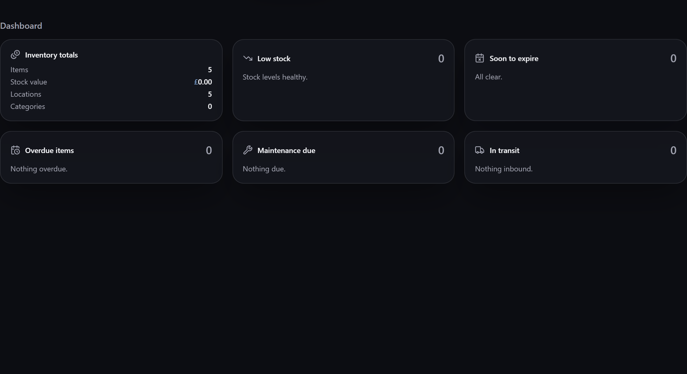

# Dashboard & widgets

The **dashboard** is your landing screen — a board of **widgets** showing totals and anything
needing attention. It's fully customisable: rearrange the widgets to put what *you* care about
front and centre.

**Where to find it:** the **Dashboard** (the home screen), configured under **Settings →
Dashboard**.

## The widget board

The dashboard is a **drag-and-drop** board. Each widget is a self-contained panel — inventory
totals, low stock, expiring soon, overdue items, maintenance due, in-transit orders, and more.
Drag them to reorder, and arrange the board to suit how you work.

Widgets are live: they read your current data, and many double as quick links straight to the
thing they summarise (select the Low stock widget to jump to what's low, for instance).

Two of them report on the app rather than your inventory: **Storage** (how much room your data
takes, and whether the browser has promised to keep it) and **Platform** (what your browser
provides, including which **storage engine** holds the database — see
[[Installing Gubbins|Installing-Gubbins]]). They're worth a glance if you're
[[diagnosing something|FAQ-and-Troubleshooting]], and easy to hide otherwise.

> **💡 Tip**
> Put the widgets you act on most at the top. If you manage a busy loan pool, lead with overdue
> and upcoming; if you run a parts store, lead with low stock and in-transit.

> **💡 Tip**
> Dragging isn't the only way to rearrange. While **Customise** is on, every card carries a small
> ▲▼◀▶ cluster that nudges it one place at a time — handy on a touchscreen — and you can move a
> selected card with the arrow keys. Each move is spoken aloud for screen-reader users ("Low stock
> moved to column 2 of 3, row 1"), so you always know where a card landed.

> **ℹ️ Note**
> A widget belonging to a [[module you've switched off|Modular-UI]] keeps its place on the board
> while it's away, so switching the module back on brings the card home. That place stays
> reserved, so a gap you can't drop into is a card waiting to return, not a fault. Nudging a card
> into it simply trades places with the one that's away.

> **ℹ️ Note**
> Widgets are independent, so a problem in one stays in one. If a card can't read its data or
> can't be drawn, that card alone shows a short message and every other card carries on as
> normal. The same is true of the inventory list: an item that can't be displayed becomes a
> single placeholder card or row rather than blanking the list.

## Hide cards with nothing to report

If you'd rather the dashboard stayed quiet when all is well, turn on **Hide cards with nothing to
report** under **Settings → Dashboard**. While it's on, a card is hidden whenever it has nothing
to flag — Low stock when everything's in stock, Overdue with no late loans, Soon to expire with
nothing due, Maintenance due when nothing is due, Budget alerts when every project is on track,
In transit with nothing on its way, and Project statuses with no live projects. A card reappears
the moment it has something to report, so you never miss anything.

The cards that always have something to say — Inventory totals, Recent activity, and the
system-status cards — are always shown, since they describe your data rather than flag a problem.

> **ℹ️ Note**
> **Customise** always shows every card, even the ones currently hidden, so you can still rearrange
> the board. The setting is off by default.

## Quick actions & nav tiles

The dashboard also offers quick actions (add, scan, search) and navigation tiles to your other
screens — a launchpad as well as an overview. What appears reflects the
[[modules you've enabled|Modular-UI]], and several aspects (nav-tile counts, the getting-started
panel) are configurable in **Settings → Dashboard**.

> **ℹ️ Note**
> The dashboard layout is a per-device preference — your phone and your workshop tablet can each
> have their own arrangement.

## Related pages

- **[[Modular UI|Modular-UI]]** — which widgets and tiles are available.
- **[[Alerts]]** — the attention data many widgets surface.
- **[[Appearance & theming|Appearance-and-Theming]]** — the look of the whole app.
