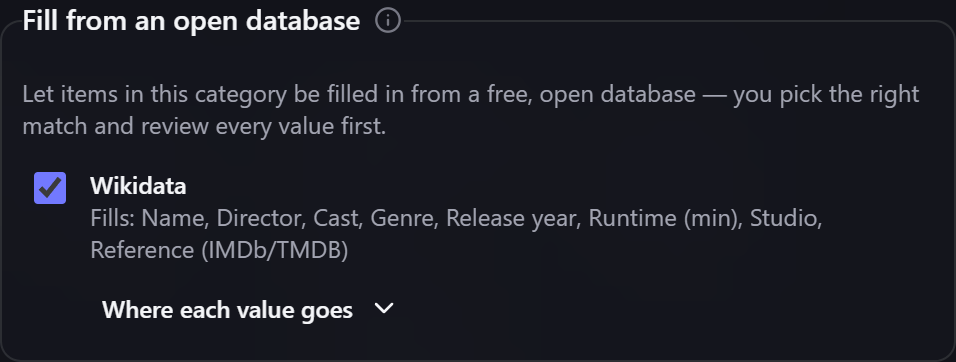

# Filling fields from an open database

Some of the things you own are already described in a **free, open database**. Gubbins can look an
item up there and **fill its [[custom fields|Custom-Fields-and-Capabilities]] in for you** — you
choose which entry is the right one, and you review every value before anything is written.

**Where to find it:** switch it on per category under **Categories & schemas → *(pick a category)*
→ Fill from an open database**. Once it is on, a **Fill from a database** panel appears on every
item in that category.

## Films, out of the box

The ready-made **Movie** [[preset|Custom-Fields-and-Capabilities]] arrives with an open film
database already attached, so nothing needs setting up: add the preset, put a film in it, and the
item gains a **Fill from a database** button straight away.

It fills the item's **Name**, plus **Director**, **Cast**, **Genre**, **Release year**, **Runtime
(min)**, **Studio** and **Reference (IMDb/TMDB)** — the fields the Movie preset already has.

> **ℹ️ Note**
> The IMDb **link** comes from the open database, not from IMDb. IMDb has no free, public interface
> Gubbins can call, so nothing here is fetched from IMDb — but the open database records the IMDb
> reference alongside everything else, which is what lands in your **Reference (IMDb/TMDB)** field.

## Using it on a category of your own

Nothing about this is tied to a category called "Movie". Tick the same database on your own
category — "Films I own", or whatever you called it — and it works exactly the same; rename the
category later and it keeps working, because the choice is remembered against the category itself
and not against its name.

Each database lists what it can fill. A value lands in the field whose **name matches**, so a
category whose fields are named the same way as the preset's needs no further setup.

## Picking the right entry — always

A search rarely has one obvious answer. Gubbins shows you the candidates it found, with a
description and a year, and **nothing is fetched or filled until you pick one** — even when there
is only a single result.

> **⚠️ Heads-up**
> This step is not busywork. Searching an open database for *Blade Runner* turns up Philip K. Dick's
> **novel** ahead of the film, because that is a registered alternative title for it. Anything that
> quietly took the top answer would fill a film's details from a book.

## Your own entries are never overwritten

What comes back is shown to you as a **plan**, not applied:

- **Empty fields are filled** automatically — that is the point of the feature.
- **A field you have already filled in is left alone.** If the database disagrees with what you
  wrote, the change is listed separately and only applied if you tick that specific field.
- **A value with nowhere to go is reported, not dropped.** If your category has no field for, say,
  the runtime, Gubbins says so rather than silently discarding it.

Nothing runs on its own: a lookup happens only when you press the button, never when an item is
created or edited.

## Where each value goes

If you have renamed a field — "Director" became "Directed by" — the name match no longer finds it,
and Gubbins tells you that value has nowhere to go. Open **Where each value goes** under the ticked
database and point that value at the field you want; you can only pick a field of the right kind, so
a year can never be sent to a text field. Set it back to **Match by name** to go back to the
automatic behaviour.

## What is sent, and who is asked

Only the item's **name** is sent, and only when you press the button. Nothing else about your
inventory leaves the device — not even the year, which is used on your own machine to mark the
candidate whose year agrees with the item's.

- **With the [[companion extension|Companion-Extension-Setup]]** installed, the extension makes the
  request for you.
- **Without it**, Gubbins asks your permission the first time and **names the exact site** it wants
  to contact. Each site is agreed to separately — saying yes to a film database is not saying yes to
  everything.

You can take that permission back at any time under **Settings → Scanning & labels → Database
lookups**: remove a site from the list and nothing is contacted again until you agree afresh. That
choice belongs to the device you made it on: it is never carried between devices by
[[settings sync|Sharing-Settings-Between-Devices]], and a [[backup|Backup-and-Restore]] only puts
it back if you tick the **This device** group when you restore.

> **💡 Tip**
> The panel is part of the **Product & supplier lookup** module. If you have switched that off under
> [[Modules|Modular-UI]], neither this nor the barcode lookup appears anywhere.

## Related pages

- **[[Custom fields & capabilities|Custom-Fields-and-Capabilities]]** — categories, their fields and
  the ready-made presets.
- **[[Scraping supplier data|Scraping-Supplier-Data]]** — the barcode and supplier-page lookups that
  work the same careful way.
- **[[Companion extension setup|Companion-Extension-Setup]]** — installing and connecting it.
- **[[Privacy & security|Privacy-and-Security]]** — everything that does, and doesn't, leave your
  device.
