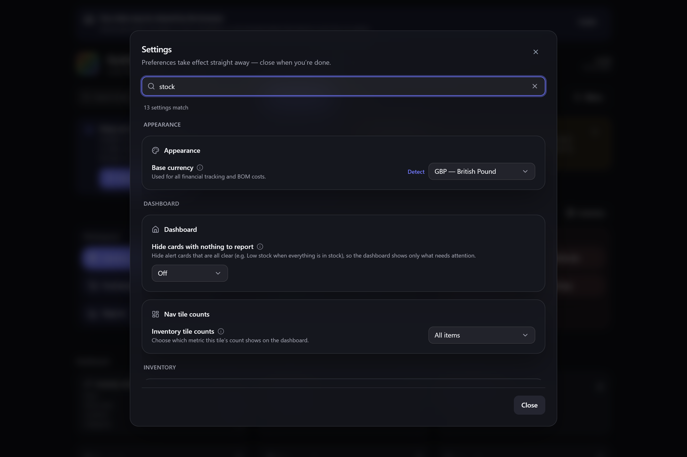

# Finding a setting

Settings is a lot of dialog — ten sections and well over sixty controls. Rather than opening each
section in turn to find the one you want, **type what you're after** and Gubbins shows every
matching setting from every section at once.

**Where to find it:** the **search box** at the top of **Settings**.

## Searching

Start typing and the section rail steps aside, replaced by a single list of the settings that
match — whichever section they normally live in. Each group of results is captioned with the
section it came from, so you still learn *where* the setting lives.

The controls in the results are the **real** ones: change a setting straight from the results
without navigating to its section first. A count above the list says how many settings matched.

Clear the box (the **✕** at its right, or press **Esc** while it's focused) to put the rail back
and return to the section you were on.

## What gets matched

A setting matches when **every word you type** appears somewhere in:

- its **name** — e.g. `oled` finds *Pure black (OLED)*;
- its **description** — the one-line explanation under the name;
- its **help text** — the fuller explanation behind the **ⓘ** badge; or
- the **section** or tab it sits in — so `scanner beep` finds *Beep on scan*, taking "scanner"
  from its section and "beep" from the row.

Words can appear in any order and in any of those places, and case doesn't matter. Typing a
section name on its own — `hotkeys`, `branding` — brings back everything in it.

> **💡 Tip**
> Searching the **help text** as well as the name is what makes vague memories work. You don't have
> to remember that the setting is called *Kiosk mode* — `wake lock`, `tablet` or `awake` all find it.

> **ℹ️ Note**
> Only settings you actually have are searchable. If you've switched a capability off in
> [[Modular UI|Modular-UI]], its settings are gone from the dialog, so they won't turn up in a
> search either.

## Related pages

- **[[Modular UI|Modular-UI]]** — hide the features (and their settings) you don't use.
- **[[Command palette & shortcuts|Command-Palette-and-Shortcuts]]** — the same type-to-find idea for
  jumping to items and screens.
- **[[Appearance & theming|Appearance-and-Theming]]** — the settings most people go looking for.
