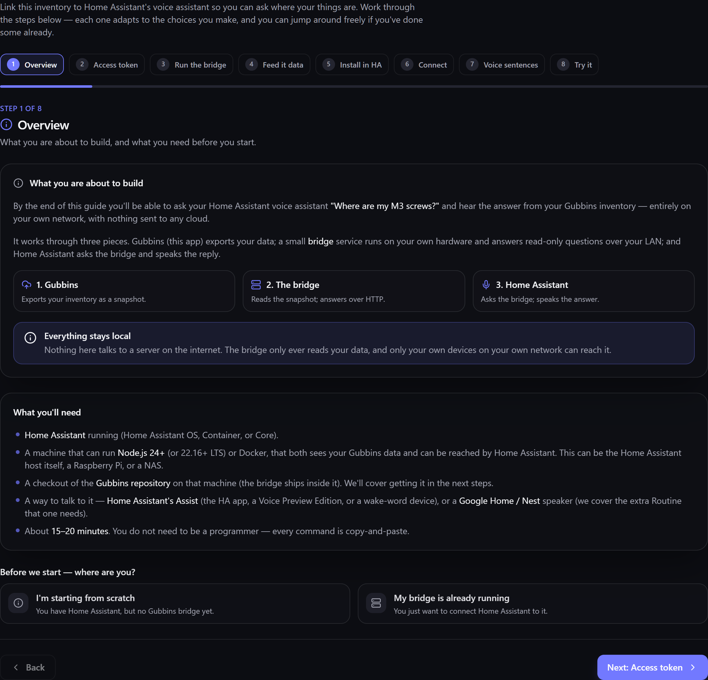

# Home Assistant integration

Connect Gubbins to **Home Assistant** and your inventory becomes part of your smart home — ask a
voice assistant *"where are my allen keys?"*, or surface stock levels as entities for automations
and dashboards. This runs through the [[bridge|Bridge-Overview]].

**Where to find it:** the **Home Assistant** screen (in the menu, when the module is enabled) —
which includes a built-in, step-by-step setup guide.

> **💡 Tip**
> You don't have to piece this together yourself. The Home Assistant screen has a **guided,
> step-by-step wizard** — Overview → Access token → Run the bridge → Feed it data → Install in HA
> → Connect → Voice sentences → Try it — that adapts to your choices and gives copy-and-paste
> commands. It's the easiest way in.

> **ℹ️ Note**
> This is an enthusiast feature that assumes you already run Home Assistant and the
> [[bridge|Running-the-Bridge]]. The in-app guide walks you through everything; the authoritative
> reference lives in the bridge `README` in the
> [Gubbins repository](https://github.com/BootBlock/Gubbins).

## What you can do

- **Ask where things are.** A custom integration answers spoken *"where is / where are my…"*
  questions, speaking the location back — Gubbins does the lookup and Home Assistant relays it.
- **Light up where it is.** Each spoken lookup also raises an event in Home Assistant naming the
  item and the location it's in, so an automation can react — the classic example being to flash
  the light above the right bin while it reads the answer back. The same details come back from the
  search action, for dashboards and scripts that don't involve voice. If you'd rather not install
  the custom integration at all, the bridge can publish the same answer to an MQTT topic instead,
  which Home Assistant or Node-RED can trigger on. It's sent live and never replayed, so a lookup
  can't light a bin hours after the fact.
- **See stock as entities.** Via **MQTT discovery**, Gubbins can publish summary figures (like
  low/out-of-stock counts) that appear automatically as Home Assistant entities — ready for
  dashboards and automations.
- **Keep the light mapping in Gubbins.** Each location entity also carries that location's own
  [[custom fields|Custom-Fields-and-Capabilities]] as attributes. So you can record which light
  sits above a shelf on the shelf itself, and have an automation read it from there — instead of
  keeping a separate list of locations and lights in your Home Assistant configuration. A
  location's fields are published as soon as MQTT publishing is on, so it's worth
  [[knowing what goes out|Webhooks-MQTT-and-iCal]] if you'd already set MQTT up.
- **Automate on changes.** Because the bridge delivers [[webhooks|Webhooks]] and change events, you
  can trigger Home Assistant automations from inventory changes (e.g. notify when something runs
  low).

## Reading a scale

Everything above sends information *to* Home Assistant. One feature reads *from* it: if you have a
scale exposed as a Home Assistant entity, [[counting by weight|Counting-by-Weight]] can pull the
current reading straight into the app rather than you typing it in.

This is **off by default** and enabled on the bridge, by pointing it at your Home Assistant
instance and giving it a **long-lived access token** (created in Home Assistant under **Profile →
Security**). Once it's on, the *Count by weight* dialog gains a scale picker, a **Read the scale**
button and a **Read the container** button for weighing the empty tray. The in-app setup guide
covers the settings on its **Run the bridge** step.

> **💡 Tip**
> When the bridge starts with this turned on, it checks the connection to Home Assistant there and
> then, and says so in its log if the address is wrong or the token was rejected — rather than
> leaving you to find out the first time you press **Read the scale**.

> **ℹ️ Note**
> The token lives on the bridge, not in the app — the app only ever receives the resulting weight.
> The bridge can *read* entity states and nothing else: it cannot call a Home Assistant service, so
> it can't switch, unlock or actuate anything in your home.

The reading goes through the bridge rather than the app talking to Home Assistant directly,
because a browser on a secure page isn't allowed to contact a plain-`http` address on your
network. The bridge sits on the same network as Home Assistant, so it can.

## Discovery

Discovery works in both directions, and each side is separately opt-in.

The bridge can **advertise itself** on your network (mDNS/zeroconf), so Home Assistant can discover
it rather than you typing addresses — an opt-in, locally-gated convenience.

The bridge can also **find Home Assistant**, so you don't have to type its address into the bridge
either. Switch it on and leave the address blank: the bridge asks your network where Home Assistant
is when it starts, uses the address it advertises, and says which one it found in its log.

> **ℹ️ Note**
> A discovered address is only ever a suggestion. An address you set yourself always wins, the
> long-lived access token is still required — discovery never finds a credential — and what the
> bridge may do with Home Assistant is unchanged: read entity states, nothing more.

If nothing answers, the bridge just starts without a scale connection and tells you so; set the
address directly and restart.

## Optional write-back

If you choose to enable it, Home Assistant can also *adjust* stock through the bridge — a peer
device that writes back through Gubbins' safe [[merge|Cloud-Sync]] so it can't cause drift.
Write-back is **off by default**.

> **⚠️ Heads-up**
> Exposing the bridge to Home Assistant means it's reachable on your LAN. Give it its own
> [[API token|Bridge-API-Tokens]] on an account with a narrow role, keep write-back off unless you
> need it, and treat the whole setup as trusted-network only. See
> [[Privacy & security|Privacy-and-Security]].

## Related pages

- **[[Bridge overview|Bridge-Overview]]** and **[[Running the bridge|Running-the-Bridge]]** — the
  foundation.
- **[[AI assistant query (MCP)|AI-Assistant-Query-MCP]]** — the same lookups for AI assistants.
- **[[Webhooks]]** — calling a Home Assistant webhook when your inventory changes.
- **[[Webhooks, MQTT & iCal|Webhooks-MQTT-and-iCal]]** — the event stream, MQTT and calendar in
  detail.
