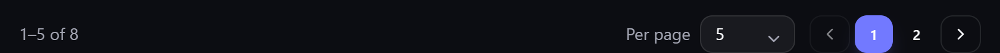

# Inventory views

The same inventory can be shown in different ways depending on what you're doing — browsing
visually, scanning a dense list, or working spreadsheet-style. Gubbins offers three **view
densities**, plus grouping, sorting and a favourites filter.

**Where to find it:** the **More** menu on the Inventory screen → **View** (and **Group by** /
**Sort by**).

## The three densities

### Card (visual)

Rich cards with photos, status and quick actions — the most scannable, best for browsing and for
photo-heavy collections.

### Data (list)

A compact one-line-per-item list — more items on screen, less visual weight. Good for working
through a lot of items quickly.

### Table (spreadsheet)

A columned table — Name, Location, Category, Stock and more — for a spreadsheet-style overview
where you can compare rows at a glance.

> **💡 Tip**
> Pick the density that matches the task: **Card** to browse, **Data** to skim, **Table** to
> compare. It's a per-device preference, so your phone and desktop can differ.

## Grouping

**Group by** clusters the list into sections — by location, category, or other axes — so a long
inventory breaks into meaningful chunks instead of one endless list.

## Sorting

**Sort by** sets the order the list is shown in. By default Gubbins leads with your favourites and
then runs alphabetically by name; pick any of these instead:

| Sort by | Useful for |
| --- | --- |
| **Name** | Straight alphabetical order. |
| **Quantity** | What you hold most — or least — of. |
| **Unit cost** | Your most and least expensive items. |
| **Manufacturer** | Keeping one brand's items together. |
| **MPN** | Working through a manufacturer's part numbers. |
| **Serial number** | Individually-tracked items in serial order. |
| **Date added** | What you've catalogued most recently. |
| **Last updated** | What you've touched most recently. |

Choosing a field applies the order that usually makes sense for it — names run **A → Z**, while
quantities, costs and dates start **largest** or **newest first**. Underneath the field list sit the
two directions, named for the field you picked (**A → Z** / **Z → A**, **Newest first** / **Oldest
first**), so you can flip it either way. Choose **Default** to go back to favourites-first.

**Where to find it:** the **More** menu → **Sort by**.

### Click a column to sort (Table view)

In the **Table** view you can sort straight from the header — click **Name**, **Stock**, or **Last
updated** to order by that column. An arrow marks the column you're sorted by and which way it's
running. Clicking the same column again reverses it, and a third click returns to the default
order, so you're never stuck in a sort you didn't want.

Columns that come from elsewhere — **Location**, **Category**, **Tags**, and your own custom
fields — aren't sortable and stay as plain labels.

> **💡 Tip**
> Sort by **Unit cost**, highest first, for a quick look at where the value in your inventory
> actually sits — or by **Last updated** to pick up wherever you left off.

> **ℹ️ Note**
> Sorting is a per-device preference and sticks between visits. Like the view density, it only
> changes the **order** items are shown in — never your data, and never which items match your
> current [[search|Search-Overview]], location and status filters. Your
> [[favourites|Saved-Searches-and-Favourites]] always lead the list, whichever sort you pick —
> the sort then orders everything below them.

## Pagination

By default a long list loads more items as you scroll (an endless list). If you'd rather step
through it in fixed **pages**, turn on **Paginate list** — a page control then appears at the foot
of the list with **Previous / Next**, numbered pages, and an editable **per-page** box where you
can pick a preset (10, 25, 50, 100) or type your own number.

**Where to find it:** the **More** menu → **Paginate list**, or **Settings → Inventory → Lists**,
where you can also set the default **Items per page**. The per-page box on the control changes the
same shared setting, so whatever you pick sticks everywhere.

> **ℹ️ Note**
> Pagination is an app-wide preference — it applies to every list that offers it: the Inventory
> list, the [[Activity log|Activity-Log]] feed, and your [[Contacts|Contacts]],
> [[Projects|Projects-and-BOM]], [[Purchase orders|Purchase-Orders]],
> [[Suppliers|Suppliers]], [[Tags|Tags-Attachments-and-Related-Items]] and
> [[Wishlist|Wishlist]] screens alike. It only changes how a list is presented — never your data,
> and never which items match your current [[search|Search-Overview]] and filters. The page control
> only appears when there's more than one page to show, and it doesn't apply to the grouped view or
> the location map / value treemap.

## Fullscreen

Turn on **Fullscreen** to stretch Gubbins across your whole display, hiding the browser's own
toolbars and tabs for a distraction-free, data-dense view. Choose it again to return to the normal
windowed view — or just press **Escape**, which always leaves fullscreen.

**Where to find it:** the **More** menu → **Fullscreen**. A tick beside it shows when fullscreen is
active.

> **ℹ️ Note**
> Fullscreen is handled by your browser, so it's offered only where the browser supports it, and it
> applies to the whole app, not just the Inventory screen. It changes nothing about your data.

## Favourites filter

Pin the items you reach for most as **favourites** (the gold star on a card) and use the
favourites filter to show just them. See [[Saved searches & favourites|Saved-Searches-and-Favourites]].

## Status filters

Above the list sits a row of **status chips** — one-tap filters for the things that usually need
your attention. Choosing more than one widens the result rather than narrowing it: you see items
matching *any* chip you've selected, so **Low stock** + **On order** shows both, not just items
that are somehow both at once.

| Chip | Shows |
| --- | --- |
| **Low stock** | Items at or below their reorder point. |
| **Out of stock** | Items that have run down to zero on hand. |
| **On order** | Items with stock inbound on an open purchase order — ordered, but not yet arrived. |
| **Expiring** | Perishables past or nearing their expiry date. |
| **Warranty** | Assets whose warranty has expired or expires soon. |
| **On loan** | Items currently checked out to a contact. |
| **Overdue** | Items checked out and past their due date. |
| **Maintenance due** | Items with a service or calibration now due. |

Each chip carries a count of how many items it would show, and chips that currently match nothing
are hidden — so the row only ever offers filters that would actually do something. Chips are
additive to whatever location and search you already have applied.

> **💡 Tip**
> **Low stock** and **On order** answer the same question from opposite sides: what's running out,
> and what's already on its way. An item that's low *and* already ordered still appears under Low
> stock — the alert tracks what's on the shelf, not what's in the post — so pairing the two chips
> is a quick way to separate "still needs ordering" from "already handled".

> **ℹ️ Note**
> A chip only appears when the feature behind it is switched on. **On order** needs
> [[Purchase orders|Purchase-Orders]]; Expiring, Warranty, On loan and Maintenance due each need
> their own module. See [[Modular UI|Modular-UI]].

## Customising cards

Card view itself is configurable — which fields show, count pills, and more — under
**Settings → Dashboard / Inventory**. See [[Appearance & theming|Appearance-and-Theming]] and
[[Dashboard & widgets|Dashboard-and-Widgets]].

### The card detail (Card view)

In **Card** view, each item card has one large **detail** slot. The ± stepper already shows the
on-hand quantity, so this slot shows a genuinely useful *second* signal instead of repeating the
number. Point it at whichever matters most to you:

- **Stock health** — a colour-coded reorder status (In stock / Low / Out), from the item's reorder
  point (the default).
- **Total value** — unit cost × quantity.
- **Last updated** — how long ago the item changed.
- **Condition** — its tracked state (Mint / Good / …).
- **Manufacturer** — the item's maker / brand.

Pick a **fallback** too. If the chosen detail has nothing to show for a particular item — say
you've set **Manufacturer** but an item has no maker recorded — the fallback is shown for that one
item instead. So **Manufacturer** with a **Stock health** fallback shows the maker where you've
entered one and the reorder status everywhere else. Leave the fallback on **None** to keep a plain
dash for those items.

**Where to find it:** **Settings → Inventory → Item cards → Visual card details** (and **Detail
fallback**). It's a per-device preference. Gauge, serialised and untracked cards are unaffected —
their detail already shows something meaningful.

> **ℹ️ Note**
> When an item has a **manufacturer** recorded, it's also shown as a small subtitle directly under
> the item's name on its card — a quick brand cue, independent of the detail slot above.

### The corner badge

Every item card and row shows a small **badge in its top-right corner** — by default the item's
[[tracking mode|Tracking-Modes]] (Bulk / Serialised / Consumable / Untracked). You can point that
slot at something else instead:

- **Tracking mode** — the tracking pill (the default).
- **Unit price** — the cost of a single unit.
- **Total value** — unit cost × quantity.
- **Condition** — its tracked state (Mint / Good / …).
- **Nothing** — leave the corner empty.

Pick a **fallback** too. If the chosen badge has nothing to show for a particular item — say
you've set **Unit price** but an item has no price — the fallback is shown for that one item
instead. So "Unit price" with a "Tracking mode" fallback shows the price where you've entered one
and the tracking pill everywhere else.

**Where to find it:** **Settings → Inventory → Item cards → Item card badge** (and **Badge
fallback**). It's a per-device preference and applies to both the Card and Data views.

> **💡 Tip**
> Set the badge to **Total value** with a **Nothing** fallback to see stock value at a glance while
> browsing, without cluttering cards for items you haven't priced yet.

> **ℹ️ Note**
> The view density only changes how items are **drawn** — it never changes your data or which
> items match your current [[search|Search-Overview]], location and status filters.

### Category watermarks

If an item's [[category|Custom-Fields-and-Capabilities]] has a **glyph** (an emoji such as 🔋 or
📖), its Visual card shows that glyph as a large, faint greyscale watermark in the bottom-right
corner — a quick cue for what kind of thing each card is. Set a category's glyph from
**Categories & schemas**, and turn all watermarks on or off under **Settings → Inventory → Item
cards → Category watermarks** (on by default; the Data and Table views never show it).

## Related pages

- **[[Search overview|Search-Overview]]** — narrowing which items are shown.
- **[[Locations & stock|Locations-and-Stock]]** — the tree that filters the list.
- **[[Bulk edit & clone|Bulk-Edit-and-Clone]]** — acting on many items at once.
