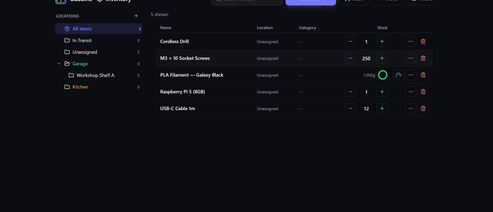

# Inventory views

The same inventory can be shown in different ways depending on what you're doing — browsing
visually, scanning a dense list, or working spreadsheet-style. Gubbins offers three **view
densities**, plus grouping and a favourites filter.

**Where to find it:** the **More** menu on the Inventory screen → **View** (and **Group by**).

## The three densities

### Card (visual)

Rich cards with photos, status and quick actions — the most scannable, best for browsing and for
photo-heavy collections.

### Data (list)

A compact one-line-per-item list — more items on screen, less visual weight. Good for working
through a lot of items quickly.

### Table (spreadsheet)

A columned table — Name, Location, Category, Stock and more — for a spreadsheet-style overview
where you can compare rows at a glance.

> **💡 Tip**
> Pick the density that matches the task: **Card** to browse, **Data** to skim, **Table** to
> compare. It's a per-device preference, so your phone and desktop can differ.

## Grouping

**Group by** clusters the list into sections — by location, category, or other axes — so a long
inventory breaks into meaningful chunks instead of one endless list.

## Favourites filter

Pin the items you reach for most as **favourites** (the gold star on a card) and use the
favourites filter to show just them. See [[Saved searches & favourites|Saved-Searches-and-Favourites]].

## Customising cards

Card view itself is configurable — which fields show, count pills, and more — under
**Settings → Dashboard / Inventory**. See [[Appearance & theming|Appearance-and-Theming]] and
[[Dashboard & widgets|Dashboard-and-Widgets]].

> **ℹ️ Note**
> The view density only changes how items are **drawn** — it never changes your data or which
> items match your current [[search|Search-Overview]], location and status filters.

## Related pages

- **[[Search overview|Search-Overview]]** — narrowing which items are shown.
- **[[Locations & stock|Locations-and-Stock]]** — the tree that filters the list.
- **[[Bulk edit & clone|Bulk-Edit-and-Clone]]** — acting on many items at once.
