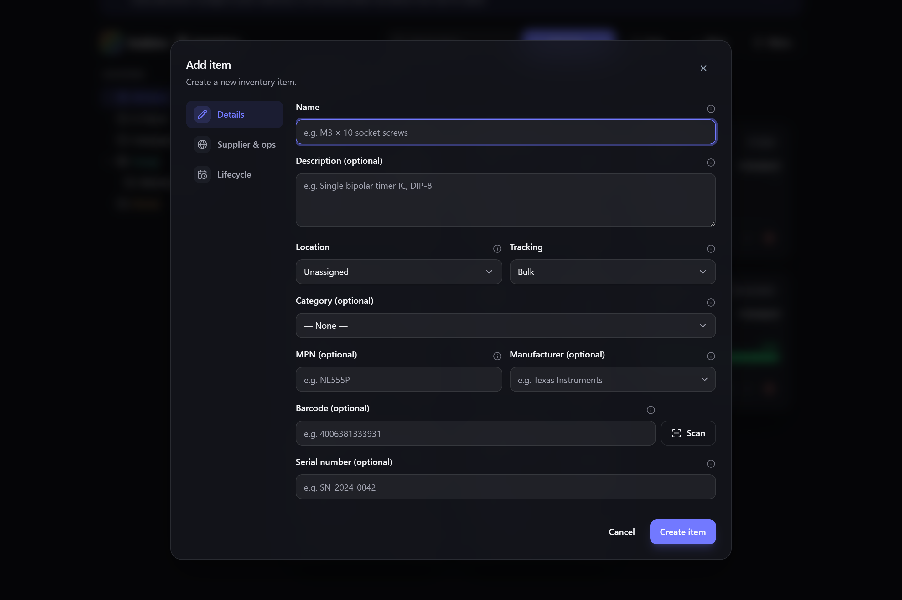
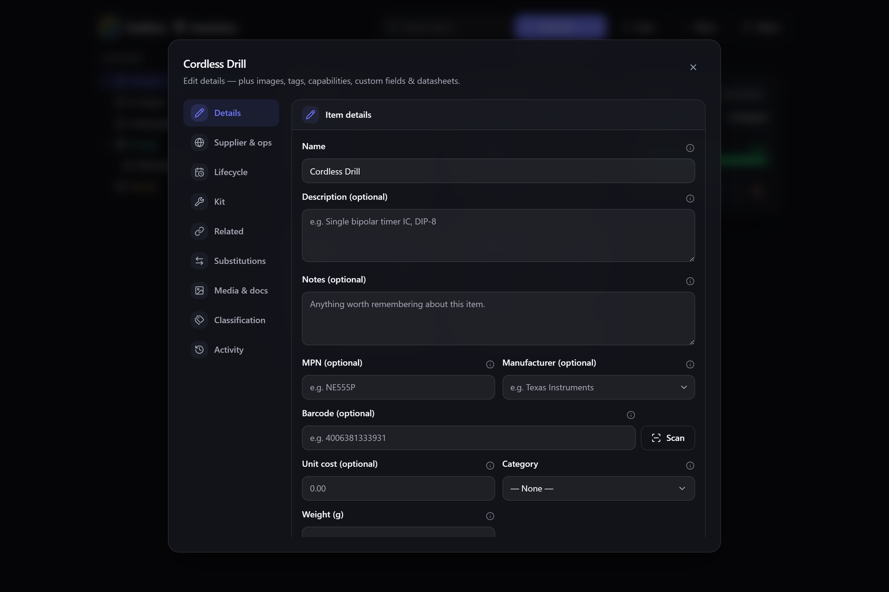
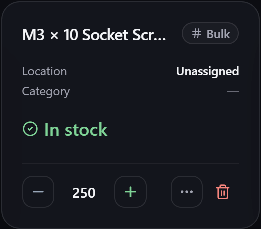

# Items

An **item** is the record for a kind of thing you track. This page covers creating and editing
items and the fields they can hold. For the *ideas* behind items and stock, see
[[Core concepts|Core-Concepts]].

**Where to find it:** Inventory → **Add item** (or select any item to open its details).

## Creating an item

Select **Add item** in Inventory. Only a **name** is required — everything else is optional and
can be filled in now or later.

Common fields at creation:

- **Name** — what the item is called. The only required field.
- **Tracking** — how its quantity behaves (Bulk, Serialised, Consumable, Untracked). This is
  the one choice worth getting right up front; see [[Tracking modes|Tracking-Modes]].
- **Initial quantity** — how many you have now (Bulk items). Consumable items instead ask for a
  **unit**, a **full capacity** and a **tare** (empty weight); serialised items track units
  individually.
- **Unit cost** and **acquired date** — used for valuation, spend and the
  [[insurance schedule|Insurance-and-Estate-Schedule]]. Type a plain figure like `8` and it
  tidies itself to your currency's decimal places when you move on (`8.00` for pounds, dollars
  or euros; whole numbers for yen); see [[Language & region|Language-and-Region]].

> **💡 Tip**
> For a one-off, always-available supply (tap water, sunlight, a shared mains outlet) you can
> mark a discrete item as **unlimited supply** — it shows as ∞ with no counter.

## Editing an item

Opening an item's **Edit details…** shows everything about it, organised into a rail of tabs so
a simple item stays simple while a complex one has room to grow.

The tabs you see depend on which [[modules|Modular-UI]] you have enabled:

| Tab | Holds |
| --- | --- |
| **Details** | Name, description, notes, part number (MPN), manufacturer, barcode, serial number, unit cost, category, weight and dimensions. |
| **Supplier & ops** | [[Supplier parts & prices|Supplier-Parts-and-Price-History]] and reorder points. |
| **Lifecycle** | [[Warranty & depreciation|Warranty-and-Depreciation]], [[current value|Current-Value-and-Revaluation]], [[maintenance|Maintenance-and-Servicing]], [[test records|Test-and-Calibration-Records]], and [[variants|Variants-and-SKUs]]. |
| **Kit** | Define the item as a [[kit of other items|Kits-and-Bundles]]. |
| **Related** | [[Cross-links to other items|Tags-Attachments-and-Related-Items]] (works with, accessory, spare-for). |
| **Substitutions** | [[Interchangeable stand-ins|Tags-Attachments-and-Related-Items]] for this item. |
| **Media & docs** | Photos and linked [[datasheets/attachments|Tags-Attachments-and-Related-Items]]. |
| **Classification** | [[Tags, capabilities and custom fields|Custom-Fields-and-Capabilities]]. |
| **Activity** | This item's [[change history|Activity-Log]]. |

> **ℹ️ Note**
> You'll only see tabs for capabilities you've enabled. If an item is missing something
> described here, the relevant module may be switched off on the [[Modular UI|Modular-UI]]
> screen — turning it back on restores the tab and any data it held.

Also set on an item: **Condition** — a structured grade (Mint / Good / Needs Repair / Out for
Calibration); see [[Condition grading|Condition-Grading]].

## Adjusting stock

From an item's card you can nudge the quantity up or down, or open its actions to **move**,
**loan out**, **sell**, or **write off** stock. Every change is recorded — see the
[[activity log|Activity-Log]].

## Archiving

Finished with an item but don't want to lose its history? **Archive** it instead of deleting.
Archived items drop out of the everyday lists but can be restored at any time, with all of
their data intact.

## Related pages

- **[[Tracking modes|Tracking-Modes]]** — choosing how an item is counted.
- **[[Locations & stock|Locations-and-Stock]]** — where an item's stock sits.
- **[[Bulk edit & clone|Bulk-Edit-and-Clone]]** — change or duplicate many items at once.
- **[[Inventory views|Inventory-Views]]** — card, list and table layouts.
