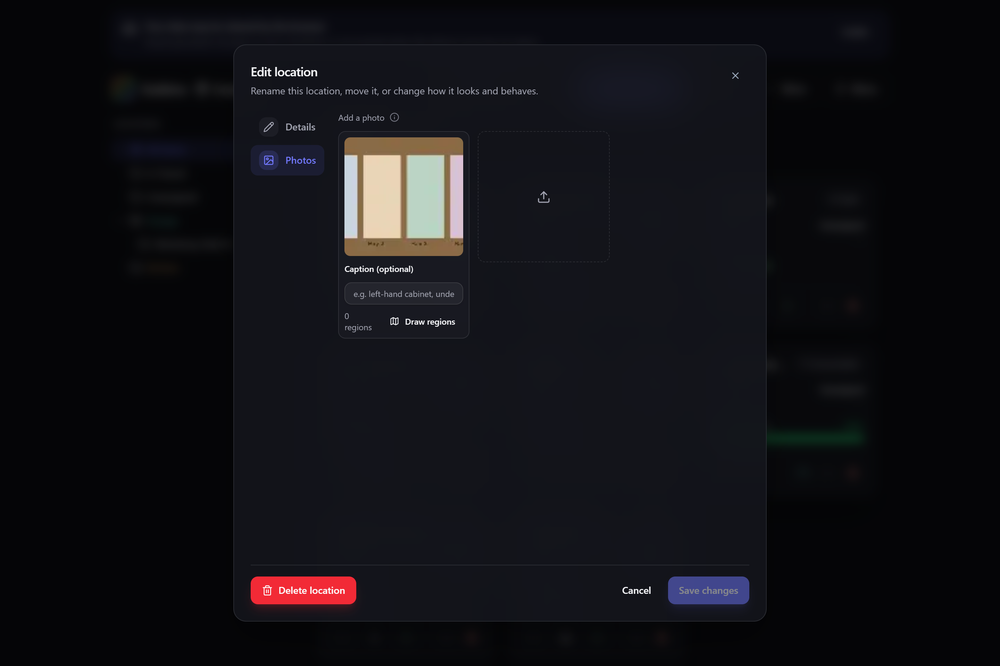
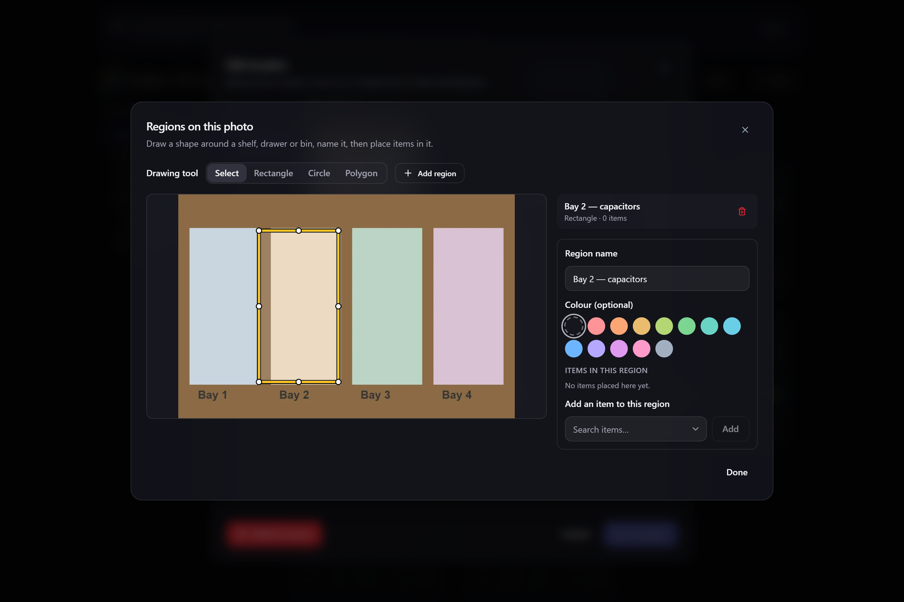

# Location photos & regions

Add **photos** to a location, draw **regions** on them, and place items in those regions — so
"where is it?" is answered by a picture of the actual shelf rather than a description of it.

**Where to find it:** the **Photos** tab when you edit a location, on the **Inventory** screen.

## Why photos

A location tells you an item is in *Garage → Shelf A*. A photo of Shelf A with a box drawn
round the third bin along tells you exactly where to put your hand. That is the whole idea:
for a workshop wall, a parts cabinet, or a storage unit, a picture carries information a name
never can.

Photos are optional. If you never add one, nothing about locations changes.

> **ℹ️ Note**
> Location photos are a capability you can switch off entirely. See
> [[Modular UI|Modular-UI]] if you would rather not see them.

## Adding a photo

Open a location for editing and choose the **Photos** tab, then pick an image. Gubbins
compresses it as it comes in — a full-resolution copy for viewing and a small thumbnail for
lists — exactly as it does for [[item photos|Items]].

You can add several photos to one location: a wide shot of the whole wall, then close-ups of
individual shelves.

Give each photo a **caption** if it helps ("left-hand cabinet", "under the bench").

## Drawing regions

A **region** is a named shape drawn on a photo — "Top shelf", "Drawer 2", "the bin behind the
door". Open a photo and choose a shape:

| Shape | Best for |
| --- | --- |
| **Rectangle** | Shelves, drawers, boxes, most things |
| **Circle** | Round bins, jars, hooks, a single spot |
| **Polygon** | Awkward areas — a corner, an L-shaped shelf, anything not a neat box |

Draw by dragging on the photo (for a polygon, click each corner, then click the first point
again to close it). Give the region a name, and optionally a colour so it stands out against
the photo.

> **💡 Tip**
> On a touchscreen, **press and hold** briefly before dragging to start drawing — a quick swipe
> still scrolls the page as usual.

> **💡 Tip**
> You do not have to use the mouse at all. Every region is listed beside the photo with its own
> position and size fields, and the arrow keys nudge a selected region (hold **Shift** to resize
> it). Anything you can draw, you can also type.

## Placing items in a region

Once a region exists, you can put items in it — and this is where regions earn their keep.

**A region is a place, not a label on one item.** Any number of items can share a region, and
one item can be in more than one. So "the resistor kit and the solder spool are both on the top
shelf" is exactly what you record, without drawing two overlapping boxes.

You can work from either end:

- **From the photo** — open a region and add items to it.
- **From the item** — an item shows every region it sits in, with a preview of the photo and a
  link back to the location.

> **ℹ️ Note**
> Placing an item in a region does **not** move its stock. Regions describe *where within a
> location* something sits; the quantity in that location is still managed as described in
> [[Locations & stock|Locations-and-Stock]].

## Removing things

- **Removing an item from a region** just unplaces it. The item is untouched.
- **Deleting a region** removes the shape and unplaces whatever was in it. No items are
  deleted.
- **Deleting a photo** removes its regions too, and unplaces their items. Again, no items are
  deleted.

> **⚠️ Heads-up**
> The **Erase photos** options in [[Danger Zone|Danger-Zone-Erasing-Data]] cover location photos
> as well as item photos. There is a separate **Location photos** target if you want to clear
> only those.

## Photos, storage and sync

Photos are the largest thing Gubbins stores, so they behave like item photos throughout:

- They count toward your storage usage, and appear in the **Storage** breakdown. If space runs
  short, Gubbins can drop full-resolution files and keep the thumbnails — see
  [[How your data is stored|How-Your-Data-Is-Stored]].
- They are included in [[backups|Backup-and-Restore]].
- With [[Cloud sync|Cloud-Sync]] on, the *thumbnail*, the regions and the item placements sync
  between your devices. The full-resolution file stays on the device that added it, so a photo
  may appear at lower quality on another device — the regions still line up correctly, because
  they are stored relative to the picture rather than in pixels.

## See also

- [[Locations & stock|Locations-and-Stock]]
- [[Items]]
- [[How your data is stored|How-Your-Data-Is-Stored]]
- [[Backup & restore|Backup-and-Restore]]
