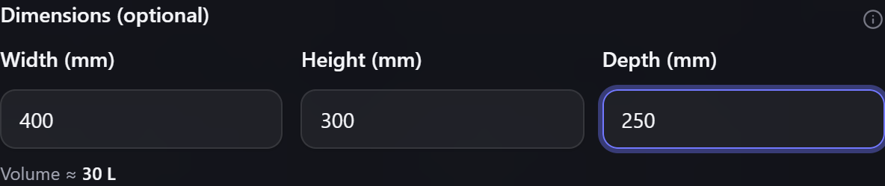
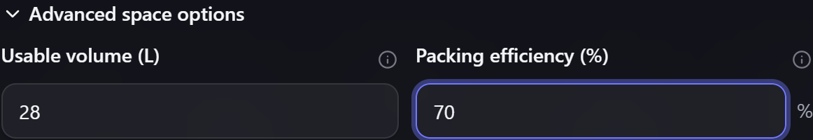
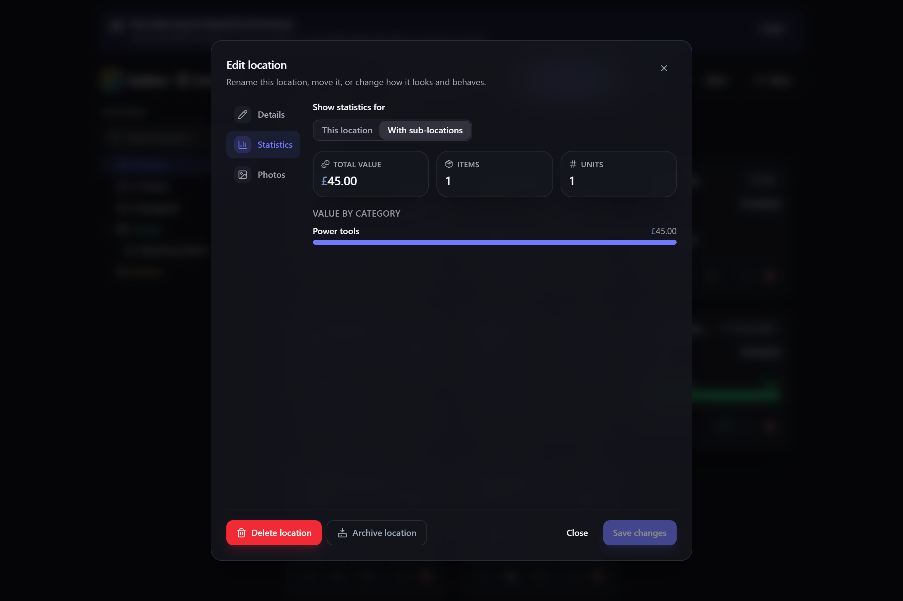

# Locations & stock

**Locations** are where your items live, and **stock** is how many you have in each one.
Together they answer the two questions Gubbins exists to answer: *what have I got?* and
*where is it?*

**Where to find it:** the location tree down the side of the **Inventory** screen.

## The location tree

Locations are **hierarchical** — a location can sit inside another, as deep as you like:

> Garage → Shelf A → Bin 3

Each location can have:

- **A name** — a room, shelf, drawer, box, or anywhere else things live.
- **A colour** — a swatch that tints the location and the cards of items stored in it, so the
  grid reads at a glance.
- **A description** — free notes about the location (what it holds, how to get to it, a link).
  It shows as a tooltip when you hover the location in the tree, and — when that location is
  selected — as a panel above the item list.
- **A parent** — the location it sits inside.

Selecting a location **filters** the inventory to what it holds, including everything nested
beneath it, and shows the location's description (if it has one) above the items. Select
**All items** to clear the filter.

Each row also carries two small buttons — **edit** the location, and **print a label** for it.
With a mouse they slide into view when you hover the row (so long names have the full width to
themselves); on a touch screen, where there is no hover, they are always shown. The built-in
**Unassigned** and **In Transit** rows can't be edited, so they show only the label button — which
sits in the same place on every row.

## Adding a location

The **+** button above the tree opens **Add location**. Give it a name — and, if you want them, a
colour, a type, a description, a capacity and its internal size — then select **Create**.

- **It nests where you are.** With one of your own locations selected, the new one is created
  *inside* it. From **All items**, or from the built-in **Unassigned** and **In Transit** rows
  (which can't hold other locations), it starts at the top level instead. Either way you can pick
  a different parent in the dialog.
- **It becomes the selection.** The new location is selected as soon as it is created, and the
  branch it landed in is opened up — so the inventory is already filtered to it and you can start
  putting things in straight away.
- **You can build a whole branch in one go.** Separate levels with `/` — `Garage/Shelf A/Bin 3`
  creates all three, reusing any level that already exists — and separate siblings with `,`, so
  `Garage/Box 1, Box 2, Box 3` adds three boxes at once. The dialog previews what a name will
  create before you commit to it; where a name fans out into siblings, the first one is selected.

## Finding a location

Above the tree is a **search box**. Type into it and the tree narrows to the locations that
match, with the branches leading down to them opened for you — so you can jump straight to a
deeply nested bin without expanding anything by hand.

Search matches the **whole path**, not just the location's own name, and every word you type has
to appear somewhere on it. So `garage bin` finds *Garage → Shelf A → Bin 3*, and typing just
`garage` narrows the tree to the Garage and everything inside it.

Clear the box (with the **✕**, or by pressing `Escape` while typing in it) and the tree comes
back exactly as you left it — searching never changes which branches you had open.

> **💡 Tip**
> Search combines with the **tag filter** below it: pick a tag *and* type a name to narrow by
> both at once.

> **ℹ️ Note**
> Very large location trees are drawn a screenful at a time as you scroll, so the sidebar stays
> quick no matter how many locations you have. Search and the keyboard still reach every one of
> them.

## On a phone

On a narrow screen there isn't room for the tree and your items side by side, so the tree moves
into a **panel that slides in from the left**. In its place, directly above the item list, sits a
**Locations** button showing what you're currently looking at — *All items*, or the location you
picked.

Tap it and the tree slides in, complete with its search box, tag filter and the buttons to add or
edit a location — nothing is left out. Choose a location and the panel closes, dropping you
straight back on the items it holds. To leave without changing anything, tap the dimmed area
beside the panel, press `Escape`, or use the **✕**.

Widen the window (or turn a tablet to landscape) and the tree simply returns to its usual place
down the side.

> **ℹ️ Note**
> This isn't a phone-only feature — the layout follows the **width of the window**, so a narrow
> browser window or a zoomed-in page gets the same treatment. Nothing is hidden either way; the
> tree is always a tap away.

The one thing this layout can't offer is **dragging an item card onto a location** — the two are
never on screen together, so there's nothing to drag onto. Use **Move item** on the card's menu,
which does the same job at any width. Re-nesting a location by dragging it onto another still
works inside the panel.

## Photos of a location

A location can also carry **photos**, with named regions drawn on them, so an item can point at
exactly where on a shelf it sits. See [[Location photos & regions|Location-Photos-and-Regions]].

> **💡 Tip**
> Descriptions support **Markdown** — headings, **bold**, lists, tables, and links all render,
> in both the hover tooltip and the panel above the item list. Handy for access notes or a link
> to a supplier.

> **💡 Tip**
> The tree is fully keyboard-navigable: arrow keys move between locations, Left/Right collapse
> and expand, and Enter selects. Great for quick filtering without reaching for the mouse.

> **💡 Tip**
> You can **drag an item card onto a location** to move its stock there — a fast way to tidy up
> after a reorganise. On a touchscreen, **press and hold** the card briefly until it lifts, then
> drag it onto the location; a quick swipe still scrolls the list as usual.

> **ℹ️ Note**
> Dragging needs the tree and your items on screen together, so it isn't available on a narrow
> screen where the tree lives in a slide-in panel (see [On a phone](#on-a-phone) above) — nothing
> happens if you press and hold, and the list keeps scrolling as normal. Use **Move item** on the
> card's menu instead; it works at any width, and it's the keyboard-friendly route on a desktop too.

## Stock is tracked per location

The key idea: Gubbins tracks quantity **separately in each location**. If you have 200 screws
on *Shelf A* and 50 in the *Kitchen*, that's one item with a total on-hand of 250 — but the app
remembers the 200/50 split. Adjust the count where the stock physically is, and the item's
total keeps itself correct automatically.

> **ℹ️ Note**
> An item's total quantity is always the sum of its per-location stock — you never edit the
> total directly, you edit stock *somewhere*.

## Transfers

A **transfer** moves quantity from one location to another. The total on-hand doesn't change —
the stock just now lives somewhere else. This is how you record moving a batch of parts from
receiving to a shelf, or loading tools into a van.

## Passing values down to the items inside

A location can hold **custom field values** of its own, and offer them to everything stored
inside it. If a whole cabinet holds Ryobi tools, set `Manufacturer = Ryobi` once on the cabinet
instead of typing it onto every item.

Open the location's **Edit** dialog and find **Inheritable fields**:

1. Pick a field from the list (fields are defined under **Categories & schemas** — see
   [[Custom fields & capabilities|Custom-Fields-and-Capabilities]]).
2. Give it a value.
3. Tick **Offer to items here**.

Items in that location — and in any location nested inside it — can then choose **Inherit** for
that field instead of entering their own value. It's opt-in per item, and the value stays live:
change it on the location and every item inheriting it updates straight away.

Nested locations override their parents, so a value on `Cabinet A` beats the one on the
`Workshop` above it.

> **ℹ️ Note**
> Setting a value and *offering* it are separate steps. Leave **Offer to items here** unticked
> to keep a value as the location's own detail — a shelf's load rating, say — without the items
> inside picking it up.

The full behaviour, including what happens when you withdraw an offer, is covered in
[[Custom fields & capabilities|Custom-Fields-and-Capabilities]].

## Capacity & fullness

A location can be given a **capacity**, after which Gubbins shows a fullness gauge — handy for
knowing when a shelf or bin is running out of room before you over-fill it.

## Dimensions & space

Alongside a count-based capacity, a location can record its **internal size** — the usable
width, height and depth inside it. Enter all three when you add or edit a location and Gubbins
works out the **volume** for you, shown right below the fields.

Sizes are entered and shown in your chosen **[[dimension unit|Units-of-Measure]]** (change it in
**Settings → Appearance**), and the volume in your **volume unit** — left on **Automatic**, that
picks a readable scale for you, so a drawer reads in litres and a whole storage bay in cubic
metres. Measurements are optional: leave them blank for anything you don't measure, and the
location behaves exactly as before.

> **ℹ️ Note**
> The width, height and depth are the **inside** of the container — the space you can actually
> fill — not its outside footprint. Measuring the interior is what makes the volume honest.

> **💡 Tip**
> The unit is only how the size is *shown* — the measurement itself is stored independently, so
> switching between millimetres, inches or metres in **Settings** simply re-displays the same
> size. Nothing is converted or lost.

### Space used, by volume

Once a location has a size, its **fullness gauge** stops counting items and starts measuring the
**space they take up**. Gubbins adds up the volume of the items placed directly here — from each
item's own width × height × depth — and shows it against the location's usable volume. It's a far
more honest picture than a plain item count: fifty resistors and one big toolbox aren't "two
things", they're wildly different amounts of space.

The gauge is always honest about how much it knows. When some items here have no measurements, a
caption reads *"based on N of M items measured"*, so a half-measured drawer never looks
deceptively empty — an item with no size simply doesn't count toward the space used. A location
with no size at all keeps its familiar item-count gauge.

The same reading also rides the **location tree** itself: a measured location shows a slim fill bar
beside its item count, turning red when its contents spill past the space. It sits apart from the
count so the number always means the item count — the bar is the volume story. Locations without a
size show no bar, keeping the tree quiet.

> **ℹ️ Note**
> Only items placed **directly** in a location count toward its space used — a cabinet doesn't
> automatically total up the volume inside its drawers. Each level reports what sits at that
> level, the same way the item count does.

### Fine-tuning: usable volume & packing efficiency

Real containers rarely fill to 100%, and few are perfect boxes. Two optional settings — behind
**Advanced space options** when you add or edit a location — let you make the estimate more honest:

- **Usable volume** overrides the width × height × depth figure for a container that isn't a neat
  box — a bag, a bin with sloped walls, a shelf with a lip. Set it and Gubbins uses your figure
  for space used instead of the box calculation. It's typed in **litres** — or **cubic feet** if
  your [[dimension unit|Units-of-Measure]] is imperial — whatever unit volumes are *displayed* in,
  so the field always asks for the same thing.
- **Packing efficiency** is the share of the volume that's realistically fillable, since rigid
  items leave gaps. Set it below 100% for a more conservative reading, or leave it blank to use the
  global default from **Settings → Appearance** — where **Default packing efficiency** sets the
  fallback for every location that doesn't specify its own.

> **💡 Tip**
> Both are optional. With just the three dimensions and everything left on its defaults, the gauge
> already gives a useful read — reach for these only when you want to tune it.

## Walk order: picking in one sweep

A location can be given a **walk order** — a plain number saying where it sits on the route you
naturally walk when gathering things. Put the shelf by the door at **1**, the bench in the middle
at **2**, the far storage at **9**, and so on. Set it from a location's **Edit** dialog; leave it
blank for any location that isn't on a route.

Its one job is to order a project's **[[Picking list|Projects-and-BOM#picking-the-parts]]**: when
you gather the parts for a build, Gubbins lists them — and each part's locations — in ascending
walk order, so you sweep through your space once instead of criss-crossing it. Lower numbers come
first; locations left blank sort after the ones you've placed, falling back to the usual
busiest-first order.

> **💡 Tip**
> You don't have to number every location — just the handful you actually visit for a build. And
> the numbers needn't be consecutive: leave gaps (10, 20, 30…) so you can slot a new spot into the
> route later without renumbering everything.

> **ℹ️ Note**
> Walk order is a deliberately simple stand-in for full floor-plan mapping: no coordinates to
> measure, no map to draw — just the order you'd walk. It's enough to turn a scattered parts list
> into a single, sensible lap of the room.

## Statistics for a location

Every location's **Edit** dialog has a **Statistics** tab that adds up what's stored there, so
you can see a location's worth and contents at a glance without opening the full reports:

- **Total value** — the combined value of all the stock physically held here, in your base
  currency. It uses the same valuation as [[Valuation & spend|Valuation-and-Spend]] (an item's
  manual current value, else its cost, else its preferred supplier's price), so a location's figure
  here always matches its row on that report's *value by location* breakdown.
- **Items** — how many distinct items have stock here.
- **Units** — the total on-hand quantity across those items.
- **Space used** — the physical volume the contents occupy, worked out from each item's
  dimensions (width × height × depth) times the number held. If the location has an internal size
  of its own (see [[Capacity & fullness|#capacity--fullness]] and its *Dimensions* / *Usable
  volume* fields), it also shows how full that is — e.g. *20% of 60 L*.
- **Value by category** — where that value sits, broken down by category, largest first.

If the location has sub-locations, a **This location / With sub-locations** switch lets you roll
the figures up its whole subtree — so *Garage* can show the value and volume of everything on every
shelf and in every drawer beneath it, not just what sits loose in the garage itself.

> **ℹ️ Note**
> Items with no value or no size set are still counted under **Items** and **Units**, but add
> nothing to **Total value** or **Space used** — a line beneath the tiles tells you how many items
> that affects, so neither total is ever quietly short without saying so.

## Watching a location for dead stock

A location can be set to report everything stored in it as **dead stock** once it goes unused —
so you can keep an eye on a whole cupboard without visiting each item. Set **Dead-stock
reporting** to *Report* when editing the location, and it applies to its sub-locations too.

You can also give the location its own **idle threshold** — how long is "too long" here —
overriding the global default for everything inside it. Handy when one place keeps different
time to the rest: deep storage might only be worth flagging after a year.

Any individual item can override what its location decided. See
[[ABC, turnover & aging|ABC-Turnover-and-Aging]] for the full picture.

## Portable & mobile containers

Not everything that holds items stays put. A **toolbox**, a **camera bag**, a **first-aid kit**
or a **van** all travel around — and Gubbins handles them without any special "mobile" setting.
The trick is that a location tracks *what is inside it*, not where it sits on a map, so a
portable container is simply a **location** like any other:

1. Make the container a location — nest it wherever it normally lives (e.g. *Garage → Camera bag*).
2. Give it a matching **type** so it reads at a glance: **Box**, **Bag** or **Vehicle** all carry
   their own icon.
3. Store the items inside it, just as you would on a shelf.

Because Gubbins records containment rather than a physical position, **picking the bag up and
carrying it out of the door changes nothing** — its contents are still "in the bag". If you want
to record that the whole container has moved home for good, drag it to a new parent in the tree;
if you're lending it out with its contents, a [[loan|Loans-Check-Out-and-In]] can be made out to
the container's location.

> **💡 Tip**
> A container is a great place to use **capacity** (below) — a first-aid kit or grab-bag with a
> set number of slots shows its fullness gauge, so you can see at a glance whether it's fully
> stocked before you head out.

## Going deeper: batches

Beneath each location, stock can be split further into [[batches & lots|Batches-and-Lots]] —
useful when different deliveries have different **expiry dates**, so Gubbins can consume the
oldest first.

## Related pages

- **[[Core concepts|Core-Concepts]]** — how items, stock and locations relate.
- **[[Units of measure|Units-of-Measure]]** — the dimension and volume units sizes are shown in.
- **[[Batches & lots|Batches-and-Lots]]** — expiry tracking and first-expiry-first-out.
- **[[Cycle counts & audit day|Cycle-Counts-and-Audit-Day]]** — checking that on-hand counts
  match reality, location by location.
- **[[ABC, turnover & aging|ABC-Turnover-and-Aging]]** — dead-stock reporting, and how a
  location's setting passes down to the items inside it.
