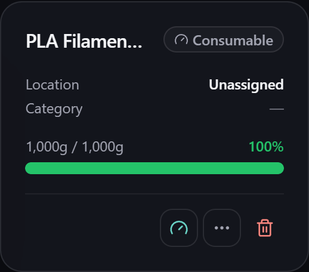

# Low stock & gauges

Gubbins can tell you, at a glance, when something is running low — with a coloured status on
every item card and thresholds you control. This is the foundation of the
[[Alerts|Alerts]] and [[reorder|Reorder-and-Shopping-List]] features.

**Where to find it:** low-stock thresholds live in **Settings → Inventory** (and per item); the
status shows on every item card.

## At-a-glance status

Every item card shows a stock status — *In stock*, *Low stock*, *Out of stock* — with a colour
so a shelf that needs attention stands out without reading numbers.

For [[consumable items|Tracking-Modes]], the status is a **fill gauge** rather than a count, so
you can see how much is left in a spool or bottle.

## Thresholds

A **low-stock threshold** is the quantity at or below which an item counts as "low". You can set:

- A **default** threshold applied across your inventory, and
- A **per-item** threshold for anything that needs a different trigger point.

There's also a separate **gauge threshold** for how empty a consumable can get before it's
flagged.

> **💡 Tip**
> Set thresholds where reordering actually makes sense — a fast-moving fastener might warrant a
> threshold of 100, while a spare you rarely need can sit at 1. Tune them in
> **Settings → Inventory**.

## Where low stock surfaces

Once something crosses its threshold it appears in several places, so you notice however you
work:

- The **Low stock** dashboard widget and the [[Alerts|Alerts]] feed.
- The inventory **status chips** and [[searches|Search-Overview]] (`qty<10`, or *"low stock"* in
  [[plain English|Natural-Language-Search]]).
- The [[reorder / shopping list|Reorder-and-Shopping-List]], which turns low stock into things
  to buy.
- Optional [[OS reminder notifications|Reminder-Notifications]] on an installed app.

## Related pages

- **[[Alerts|Alerts]]** — everything needing attention in one feed.
- **[[Reorder & shopping list|Reorder-and-Shopping-List]]** — acting on low stock.
- **[[Tracking modes|Tracking-Modes]]** — how counts and gauges differ.
