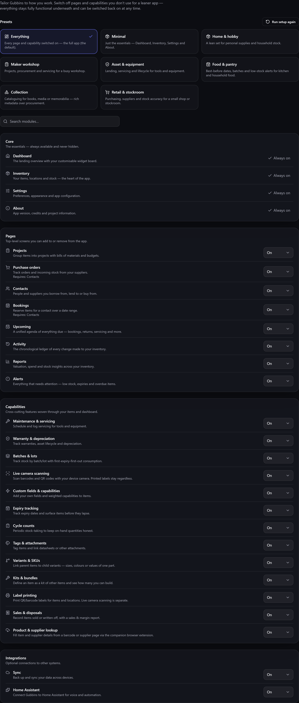

# Modular UI

Gubbins does a *lot* — but you probably don't need all of it. **Modular UI** lets you **hide the
pages and capabilities you don't use**, so the app is exactly as simple (or as powerful) as you
want. Nothing is deleted; hidden features keep all their data and can come back any time.

**Where to find it:** the **Modules** screen (from Settings, the first-run chooser, or the "module
hidden" prompt).

> **ℹ️ Note**
> With the [[Users module|Users-and-Accounts]] switched on, this screen answers to a
> [[permission|Roles-and-Permissions]] like any other: **Modules → View** opens it, and **Modules →
> Change** is needed to switch anything. Without Change you can see which modules are on and change
> none of them — the presets, the per-module switches, **Run setup again**, the first-run chooser
> and the **Show this module** button on the "module hidden" prompt are all withheld. That prompt
> keeps **Continue anyway**, so nothing becomes a dead end.
>
> This is the one permission that guards the others: switching **Users** off takes the sign-in gate
> down with it, so anyone who could do it could give themselves everything. The built-in
> **Manager** role deliberately gets View without Change for that reason.

## Two kinds of module

- **Pages** — whole screens: Projects, Purchase orders, Contacts, Bookings, Reports, and more.
- **Capabilities** — cross-cutting sub-features woven through the app: Maintenance, Batches,
  Kits, Variants, Scanner, NFC tags, Sales, and others.

A handful of essentials — Dashboard, Inventory, Settings, About — are **always on** and can't be
hidden.

## Modules that start switched off

Most modules are on to begin with, and you turn off what you don't want. A few work the other way
round and are **off until you ask for them**, because switching one on changes how the whole app
behaves. **[[Users|Users-and-Accounts]]** — accounts, sign-in and per-person permissions — is one of
these. No preset switches it on — not even **Everything** — so it never arrives by surprise.

> **⚠️ Heads-up**
> Applying a preset switches *off* every module the preset doesn't list, and no preset lists
> **Users**. So if you have sign-in turned on and then pick a preset, sign-in is switched off. Your
> accounts and roles are kept, but you'll need to turn the module back on. This is exactly why
> applying a preset needs **Modules → Change** once sign-in is on — and why the first-run chooser
> is withheld from anyone without it.

> **ℹ️ Note**
> Turning **Users** on puts a [[sign-in screen|Signing-In]] in front of the app, so Gubbins confirms
> first that somebody can still get in. Turning it back off loses nothing — accounts, roles and the
> record of who changed what are all kept.

## Turning things off (and on)

Switch a module off and it disappears **everywhere** at once — from the nav menu, dashboard tiles
and widgets, the [[command palette|Command-Palette-and-Shortcuts]], item-detail tabs, and the
[[Alerts]]/[[Upcoming|Upcoming-Agenda]] feeds. Switch it back on and it all returns, with your data
untouched.

- **Start from a preset** in the skippable [[first-run chooser|First-Run-and-Quick-Start]], or
  fine-tune every module on the Modules screen.
- **Dependencies are handled.** Some modules rely on others (Purchase orders and Bookings need
  Contacts); turning one off cascades sensibly, and turning one on offers to enable what it needs.

> **💡 Tip**
> If Gubbins feels like more than you need, start by hiding whole areas you're sure about
> (Projects, Purchase orders) — the app immediately feels lighter, and you've lost nothing.

> **ℹ️ Note**
> Modules are a **per-device** choice. A shared workshop tablet can show a lean, focused set while
> your own machine has everything — same data, different surface. This is why a feature described
> in this wiki might not be visible for you: it may simply be switched off here.

## Hiding something for one kind of thing only

Modules are all-or-nothing for the whole device, which is the wrong tool when a capability
matters for *some* of what you own but not the rest — maintenance is essential for your power
tools and meaningless on your film collection.

For that, a **category** can hide the sections its own items don't need. See
[[Hiding the sections a category doesn't need|Custom-Fields-and-Capabilities]].

The two work together, and always in the same direction: a module switched off here is off
everywhere, and a category can only hide **further**, never bring one back.

## Related pages

- **[[Quick start|First-Run-and-Quick-Start]]** — the first-run module chooser.
- **[[Dashboard & widgets|Dashboard-and-Widgets]]** — what modules add to the dashboard.
- **[[Kiosk & tablet mode|Kiosk-and-Tablet-Mode]]** — pairing a lean module set with a locked-down
  display.
- **[[Users & accounts|Users-and-Accounts]]** — the opt-in module for sharing a device with other
  people.
- **[[Custom fields & capabilities|Custom-Fields-and-Capabilities]]** — hiding sections for one
  category rather than the whole device.
