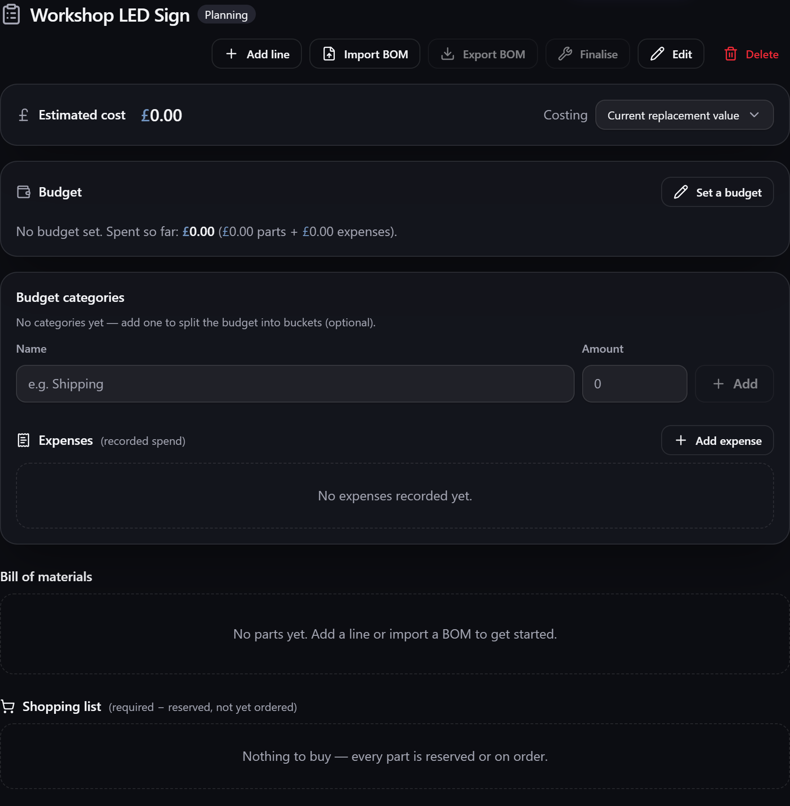

# Projects & BOM

A **project** groups items into a build with a **bill of materials** (BOM), reservations and a
budget — a repair, a make, a job, a kit you're assembling. It answers *"do I have everything I
need, and can I afford it?"*

**Where to find it:** the **Projects** screen (in the menu, when the module is enabled).

Projects accumulate as builds come and go, so the list splits into pages once you have more than
one screenful. Turn it on with **Paginate list** (or **Settings → Inventory → Lists**) and every
project stays reachable however many you have — see the [[pagination control|Inventory-Views]].
With it off, the list shows as many projects as it can read at once and tells you how many are
left over.

## Finding a project

Above the list sit a **search box**, a **status** filter and a **sort** picker, which appear as
soon as you have a project to look through. Paging is a slow way to find a build you can already
name, so:

- **Search** narrows the list to projects whose name contains what you type. Press `Escape` (or
  the **✕**) to clear it.
- **Status** narrows to one stage — **Planning**, **Active**, **Completed** or **Archived** — or
  **All statuses** for everything. The everyday use is hiding the builds you've finished.
- **Sort** offers **Newest first** (the default), **Oldest first**, **Name A–Z** and **Name Z–A**.

All three look at **every** project, not just the page on screen, so a search reaches a build that
would otherwise sit pages away. Use them together — searching within **Active** only, say. If a
filter leaves nothing, the list says so and offers **Clear filters** to get back.

## Choosing a project on a phone

The Projects screen normally shows your list of projects down the left and the selected project's
details beside it. On a narrow screen there isn't room for both, so the list moves into a **panel
that slides in from the left**, and a **Projects** button above the details names whichever project
you're looking at.

Tap it to bring the list in, pick a project, and the panel closes on the one you chose. Tap the
dimmed area beside it, press `Escape`, or use the **✕** to leave the selection as it was. Widen the
window and the list returns to its usual place — see
[[the same behaviour on the Inventory screen|Locations-and-Stock]].

## The bill of materials

A project's **BOM** lists the items it needs and how many of each. From that list, Gubbins works
out:

- What you **already have** versus what's **short**.
- An automatic **shopping list** of the missing pieces.

So starting a project immediately tells you whether you can proceed or need to buy first.

However long the bill of materials is, the whole of it is shown — and the whole of it is what gets
[[exported|Export-and-Import]] when you use **Export BOM**.

### Missing prerequisites

If a part on the list **requires** another item that *isn't* also on the list, Gubbins marks that
line with a warning glyph naming what's missing. It catches the bill of materials that looks
complete but would build into something unusable — the controller without its power supply, the
printer without its build plate.

Add the missing item as its own line to clear the flag. As with everything on the BOM it's
advisory: nothing stops you ordering or picking the list as it stands. Record the dependency on
the **Related** tab of the item that needs it; see
[[Related items|Tags-Attachments-and-Related-Items]].

## Reservations

**Reserve** stock for a project to earmark it for that build. A reservation is a *claim on stock
you already have* — it doesn't move anything and it never conjures parts up, so what it can
promise depends on whether the stock is really there.

Each matched BOM line shows how many units are **available**: what is on hand, less everything
every open project has reserved. Items out on [[loan|Loans-Check-Out-and-In]] are already out of
the on-hand figure, so they are never counted twice.

A reservation can be **Tentative** (a soft hold, "probably this build") or **Actual** (a firm
commitment). When several projects want the same part, the firm claims are honoured first, and
then the earliest.

### When there isn't enough to go round

Nothing stops two projects reserving the same units, and stock can be sold, lent or used up after
a reservation was made. So Gubbins checks, rather than taking a reservation at its word:

- The project that loses out is flagged on its BOM line, and the units it didn't get go **back on
  its shopping list** — they still have to be bought.
- The item's own **Reservations** panel lists every project holding it, how much each one actually
  holds, and warns when more is reserved than exists.

> **ℹ️ Note**
> Reserving is a plan, not a lock. It doesn't stop you spending the stock elsewhere — it just
> makes sure that when you do, the project that was counting on it says so.

Reservations are released when a project is completed or archived.

> **ℹ️ Note**
> An **Actual** reservation of a matched part, and marking that line as **in transit**, are both
> recorded in the part's [[activity log|Activity-Log]] (a Tentative hold isn't recorded at all, and
> nor is a line with no matching item) — but neither is stock actually moving, so neither counts as
> a movement in your [[reports|Reports-Overview]]. Only the **receipt**, when the parts land,
> changes the figures behind the stock-movement chart, the [[turnover|ABC-Turnover-and-Aging]]
> ratios and the valuation trend.

> **⚠️ Heads-up**
> A receipt only adds stock where the matched item is counted by quantity — a **Bulk** item. Match
> a **Serialised**, **Consumable** or **Untracked** part and receiving records the delivery against
> the line and in the item's [[activity log|Activity-Log]], but moves no stock, because there is no
> count to add to. The receive control says so and drops its batch and expiry fields. See
> [[Tracking modes|Tracking-Modes]].

**Where to find it:** the item's **Reservations** panel is on the **Supplier & ops** tab of the
item's detail screen.

## Costing & the shopping list

A project can total its cost, and toggle how it's **costed** (for example, what you'd pay to buy
the missing parts versus the value of everything in the build). The missing-parts shopping list
flows into your [[purchasing|Reorder-and-Shopping-List]].

The list counts a line's reservation only as far as real stock backs it, so a part another project
got to first still shows up as something to buy.

> **💡 Tip**
> Projects are great even for one-off jobs: drop in the parts, see what's short, and let Gubbins
> build the shopping list — no need to work it out on paper.

> **ℹ️ Note**
> A **project** is a one-off build with its own BOM and budget. A reusable assembly you make
> repeatedly is better modelled as a **[[kit|Kits-and-Bundles]]** — that page has a fuller
> side-by-side comparison of the two.

## Picking the parts

When it's time to build, the **Picking** list turns the BOM into a walk-and-tick-off worksheet.
For every line it shows **where to find it** — the exact locations its stock sits in (for example
*"3 in Garage · Shelf B, 2 in Loft bin 4"*) — drawn straight from your
[[per-location stock|Locations-and-Stock]]. Gather each part, tick it off, and a progress bar
tracks how much of the build you've collected.

A line with no matching item, or a matched item you're out of, is still listed so nothing is
forgotten — it just shows there's no shelf to walk to.

### Picking in walking order

If you give your locations a **[[walk order|Locations-and-Stock#walk-order-picking-in-one-sweep]]**
— the order you pass them on a sweep of your space — the worksheet lists both the parts *and* each
part's locations in that route order, so you gather everything in one pass instead of doubling back.
Locations you haven't placed on the route sit at the end, falling back to busiest-first. Until you
set any walk order, the list stays in its usual order, so this only ever helps.

Once **every** line is ticked, the worksheet surfaces a **Finalise** step: the natural moment to
consume the gathered parts into the finished build (a new container location, a single assembled
item, or simply used up).

> **💡 Tip**
> Picking is independent of reserving. **Reserve** to earmark stock ahead of time; **pick** to
> mark it physically collected when you're actually at the shelf. A part can be reserved but not
> yet picked, or picked without ever being reserved.

## Finishing the build

**Finalise** turns the gathered parts into the finished thing. Choose what the build became:

- **Container** — the project becomes a **[[location|Locations-and-Stock]]** holding the parts the
  build used. Good for a box of spares, a populated drawer, a machine you'll take apart again.
- **Singular object** — the parts merge into **one new item**. Good for something you now own as a
  single thing: an assembled board, a built bike.
- **Permanent consumption** — the quantities used are consumed and leave your active stock. Good
  for glue, solder, screws that are now inside something.

### What it takes from stock

Finalising draws **the quantity each BOM line asks for** — no more. A build that used 4 screws
takes 4 screws; the rest of the box stays exactly where it is, still in your inventory. A part is
only archived (or, for a container, moved bodily into the new location) when the build takes the
**last** of it.

Before you commit, the dialog lists every matched part and what will happen to it — *"Takes 4 of
500"*, *"Takes the last 2 — then archived"*, *"Moves into the container"* — so nothing is a
surprise afterwards. A part that is **one physical thing** rather than a divisible quantity is
taken whole: a [[serialised item|Items]], a presence-only item, or a
[[gauge|Low-Stock-and-Gauges]] going into a container (you can decant glue out of a bottle, but a
box holds the bottle). An **unlimited supply** records what the build drew without ever running
down.

If a part hasn't enough stock for what the BOM asks, finalising is **refused** and the dialog names
the part along with what it needs and what's on hand. Add the stock, or lower that line's quantity,
and try again.

> **⚠️ Heads-up**
> Finalising marks the project **Completed** and cannot be undone automatically — the parts have
> been taken. Check the summary before pressing the button.

> **ℹ️ Note**
> Each part's [[activity log|Activity-Log]] records the exact quantity the build consumed, so your
> usage reports and [[ABC / turnover figures|ABC-Turnover-and-Aging]] see what the build really used.

## Exporting the BOM

Use **Export BOM** (beside *Import BOM*) to save the bill of materials as a file — for sharing a
parts list, ordering, or printing. Pick the form that suits:

- **CSV** or **TSV** — a spreadsheet of every line, ready for Excel, Sheets or a supplier upload.
- **Excel workbook (.xlsx)** — opens straight into Excel or Sheets with numbers kept as numbers.
- **JSON** — the lines as structured data, for a script or another tool to read.
- **Markdown table** — drops straight into notes, a README or a wiki.
- **HTML** — a tidy, standalone page that opens in your browser and **prints** cleanly.
- **Plain text** — a simple aligned table to paste anywhere.

Each line carries its part details (designator, MPN, manufacturer), the required / reserved /
received quantities, its reservation and procurement status, and the unit and line cost — so the
exported file is a complete snapshot of the build's parts.

The same menu also offers an **EDA BOM (grouped CSV)** — the layout electronics tools such as
KiCad or Altium expect. Parts that share a value, MPN and manufacturer are merged into one row,
their reference designators listed together (`R1, R2, R3`) and their quantities summed, so the file
imports cleanly into a schematic or PCB tool's BOM.

> **💡 Tip**
> Choose **HTML** when you want a printout to take to the bench or the shop — it's laid out for
> paper, **CSV/TSV** or **Excel** when a supplier or spreadsheet needs to read the numbers back, and
> **EDA BOM** when you're feeding the parts list into an electronics design tool.

## Related pages

- **[[Budgets]]** — setting and tracking a project's budget.
- **[[Kits & bundles|Kits-and-Bundles]]** — reusable assemblies.
- **[[Reorder & shopping list|Reorder-and-Shopping-List]]** — buying what a project needs.
- **[[Export & import|Export-and-Import]]** — projects get their own export sub-folders.
