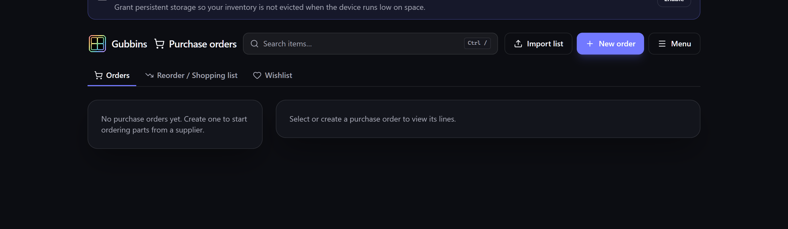

# Purchase orders

A **purchase order** (PO) records what you've ordered from a supplier and tracks it
until it arrives — including part-deliveries. It closes the loop between *"we're low"* and *"it's
on the shelf"*.

**Where to find it:** the **Purchase orders** screen (in the menu, when the module is enabled).

## Creating an order

Raise a PO against a supplier — entering the supplier's name — and add the items and quantities
you're ordering. The ordered stock is now **on its way** — Gubbins tracks it as **in transit** so
you can see what's inbound.

## Ordering in another currency

An order can record its own **currency** — an ISO code such as `USD`. Leave it blank and the order
is in your base currency (set in Settings). Gubbins stores that currency exactly as you entered it
and **never converts** between currencies, because it holds no exchange rates.

Everywhere an order's money is shown — the order total in the list, and each line's price — it is
shown in **that order's** currency, so a `EUR` order reads in euros rather than under your base
currency's symbol.

### When a supplier quotes in a different currency

A line's cost is recorded as a plain number in the **order's** currency. So if you add a line for a
part whose [[supplier|Supplier-Parts-and-Price-History]] quotes in euros to an order priced in
pounds, Gubbins won't copy the supplier's figure across — that number would be recorded as pounds
without ever having been converted.

Instead, the Add line dialog says so: the supplier's price breaks stay in the currency they were
quoted in, a notice names both currencies, and the **Unit cost** field is left empty for you to
enter what the line actually costs in the order's currency.

> **💡 Tip**
> If you buy from a supplier in their currency regularly, raise the whole order in that currency.
> The quotes then match the order and prices fill in automatically as usual.

> **⚠️ Heads-up**
> Because those amounts can't be converted, an order in another currency is **left out** of the
> [[spend report|Valuation-and-Spend]] rather than added to a total it doesn't match. The report
> says how many orders it left out.

## Importing a purchase list

If the list of what you're buying already exists somewhere else — a supplier's basket export, a
quote, a spreadsheet of parts, or just a list you typed out — you don't have to re-key it. Use
**Import list** to paste it or upload a file, then choose where it should go:

- **This purchase order** — add the lines to the order you're looking at.
- **A new purchase order** — name a supplier and Gubbins raises a draft order containing the lines.
- **The [[Wishlist]]** — for things you're not ordering yet.

Gubbins recognises **CSV / TSV**, **JSON**, a **Markdown** or **HTML** table, or a plain list with
one thing per line — the format is detected automatically, or you can pick it with **Interpret
as**. Columns are matched by their headings, so `Description`, `Qty`, `Unit price`, `MPN`,
`Supplier` and `Link` are all understood however they're capitalised or punctuated. Where a row
gives only a **line total**, the unit price is worked out from the quantity.

Everything is **previewed before anything is written**, so you can see exactly what will be added.

> **💡 Tip**
> A plain list works fine — `3x M3 bolts` on its own line becomes a line for three of them. Bullets
> and numbering are ignored, so you can paste a list straight out of your notes.

> **ℹ️ Note**
> Lines carrying an **MPN** or a supplier **order code** are matched to items you already track, so
> receiving them moves the right item's stock. Anything unmatched is still added — just as a plain
> line with its description.

## Receiving stock

When a delivery arrives, **receive** it against the PO. Gubbins supports:

- **Partial receipts** — receive some now, the rest later; the outstanding quantity stays on
  order.
- **Split lines** — a line delivered across multiple shipments is handled cleanly.

Received stock lands in your inventory and the in-transit figure drops accordingly.

> **💡 Tip**
> The **In transit** dashboard widget and the *In Transit* location view show everything inbound
> at a glance — handy for knowing what to expect before it turns up. To see it item-by-item
> instead, use the **On order** status chip on the Inventory screen
> ([[Inventory views|Inventory-Views]]).

> **ℹ️ Note**
> Purchase orders need [[Contacts]] enabled. If the module is off, turn it on in
> [[Modular UI|Modular-UI]] and the dependency is offered automatically.

## Related pages

- **[[Reorder & shopping list|Reorder-and-Shopping-List]]** — deciding what to order.
- **[[Supplier parts & price history|Supplier-Parts-and-Price-History]]** — supplier codes and
  prices.
- **[[Wishlist]]** — things you want but aren't ordering yet.
