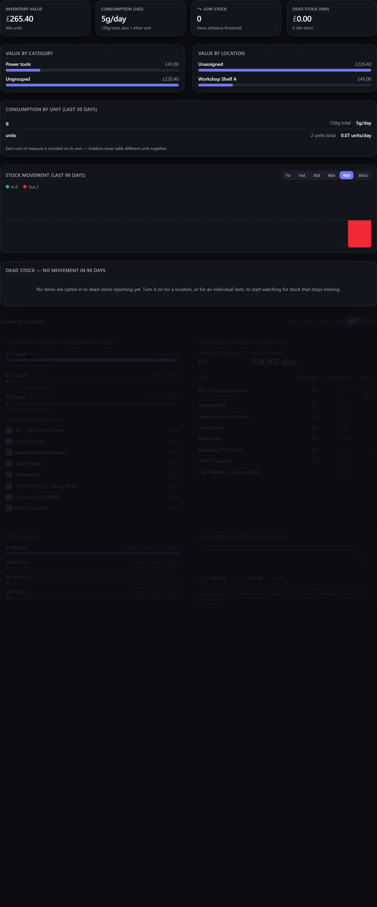

# Reports overview

The **Reports** screen turns your inventory into insight — what it's worth, where your money
goes, what's moving and what's stuck. Every report is computed **on your device** from your live
data, and most can be exported.

**Where to find it:** the **Reports** screen (in the menu, when the module is enabled).

## What's in the suite

| Report | Answers | Page |
| --- | --- | --- |
| **Valuation** | What is my inventory worth, by category and location? | [[Valuation & spend\|Valuation-and-Spend]] |
| **Spend** | Where has my money gone over time? | [[Valuation & spend\|Valuation-and-Spend]] |
| **ABC analysis** | Which items matter most (the vital few vs the trivial many)? | [[ABC, turnover & aging\|ABC-Turnover-and-Aging]] |
| **Turnover** | How fast is stock moving? | [[ABC, turnover & aging\|ABC-Turnover-and-Aging]] |
| **Stock aging / dead stock** | What's been sitting untouched? (dead stock is opt-in) | [[ABC, turnover & aging\|ABC-Turnover-and-Aging]] |
| **Consumption rate** | How fast is stock being used up, unit by unit? | Below on this page |
| **Sales & margin** | What have I sold, and at what profit? | [[Sales & margin\|Sales-and-Margin]] |
| **Data hygiene** | Which records are incomplete? | [[Data hygiene\|Data-Hygiene]] |

Plus two printable documents: the **[[insurance / estate schedule|Insurance-and-Estate-Schedule]]**
and the **[[parts catalogue|Parts-Catalogue]]**.

## Time periods

The time-based reports — **Advanced analytics** (turnover and valuation over time), **Stock
movement**, **Spend analytics**, and **Sales & disposals** — each carry a small period selector:
**7d**, **14d**, **30d**, **60d**, **90d** and **365d**, running shortest on the left to longest
on the right. Pick the window that suits the question — a fortnight for a quick pulse, a year for
the long view.

Each report **remembers its own choice** independently, and the choice sticks between visits — so
you can leave Spend on a year while Sales stays on the last month, and they'll be just as you left
them next time.

**Stock movement** charts what came in and what went out over the period you pick, so you can see
how quickly things flow through your inventory rather than just where they've ended up.

Your choice carries through to the **CSV export**: exporting a report that has a period selector
gives you the span you've selected on screen, so the file always covers the same period as the
figures you were looking at. Reports with a fixed span — **ABC analysis** (always annual),
**consumption rate** and **data hygiene** — have no selector and export over their own set period.

## Long lists in a report

Some reports have more rows than usefully fit in a panel — a hundred categories in the valuation
breakdown, or every idle item in dead stock. Those panels open on the most important rows and say
so underneath: *"Showing 12 of 40 categories"*, with **Show more** to bring the next batch in and
**Show fewer** to fold it back up.

The count is always the truth about the whole set, so you can tell at a glance whether you're
looking at all of something or the head of a longer list. Nothing is quietly left out — and the
headline figures (total value, portfolio turnover, the capital tied up in dead stock) are always
computed over **every** row, not just the ones on screen.

> **💡 Tip**
> For a long list you want to work through properly — dead stock especially — the **CSV export**
> gives you every row at once, ready to sort and tick off in a spreadsheet.

## Consumption rate

The **consumption rate** looks at everything that was *used up* over the last 30 days — items
consumed, sold, written off or found missing at a count, and material drawn from
[[gauges|Low-Stock-and-Gauges]] — and tells you how fast it is going.

Stock that is only expected back does not count. A [[loan|Loans-Check-Out-and-In]] leaves the
shelf and returns, a [[return to a supplier|Purchase-Orders]] reverses a delivery, and taking a kit
apart turns it back into its own components — none of those is stock used up, so none of them is
counted here. That keeps this figure answering "how fast am I getting through things?" rather than
"how busy have my shelves been". The **Stock movement** chart answers the second question, and
counts every one of those movements.

It is reported **one line per unit of measure**, never as a single figure. Filament weighed in
grams, resin measured in millilitres and screws counted one by one are different kinds of thing,
and Gubbins holds no way to convert between them, so adding them together would produce a number
that means nothing. Each unit gets its own total and its own daily rate; items that simply count
things (no unit of measure set) are gathered into one **units** line.

The headline card at the top of the screen shows the busiest single unit, labelled with that unit,
and says how many others there are — the full list is in the **Consumption by unit** panel, and the
CSV export carries a `unit` column so every figure stays labelled in a spreadsheet.

> **ℹ️ Note**
> This is the same principle as the [[valuation reports|Valuation-and-Spend]] declining to convert
> a foreign-currency price: Gubbins would rather show you two honest figures than one invented one.

## Exporting

Any report can be exported as **CSV**, so you can take the numbers into a spreadsheet or share
them. The printable schedule and catalogue use your browser's own print (→ Save as PDF) — no
extra software.

> **💡 Tip**
> Reports are a health-check for your inventory as much as a set of numbers — a quick look at
> [[dead stock|ABC-Turnover-and-Aging]] and [[data hygiene|Data-Hygiene]] now and then keeps your
> catalogue lean and trustworthy.

> **ℹ️ Note**
> Reports read your data where it lives — on your device — and never send it anywhere. What you
> export or print is the only thing that leaves. See [[Privacy & security|Privacy-and-Security]].

## Related pages

- **[[Valuation & spend|Valuation-and-Spend]]**, **[[ABC, turnover & aging|ABC-Turnover-and-Aging]]**,
  **[[Sales & margin|Sales-and-Margin]]**, **[[Data hygiene|Data-Hygiene]]**.
- **[[Insurance & estate schedule|Insurance-and-Estate-Schedule]]** and
  **[[Parts catalogue|Parts-Catalogue]]** — the printable documents.
