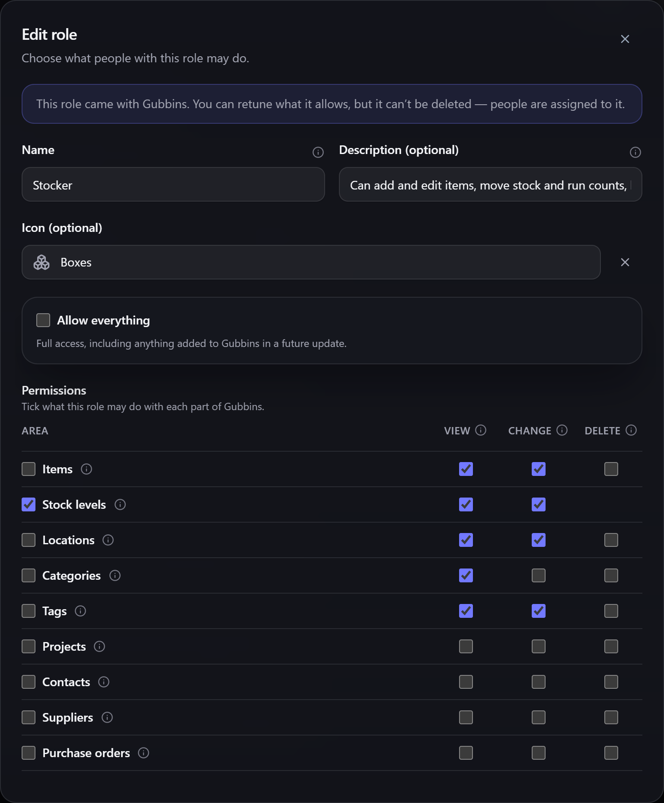

# Roles & permissions

A **role** is a named set of permissions you hand to one or more people — *"Stocker"*, *"Viewer"*,
*"Workshop lead"*. Rather than ticking boxes for every person, you describe the job once and assign
it.

**Where to find it:** the **Roles** section at the bottom of the **Users** screen (part of the
[[Users module|Modular-UI]]).

## The roles Gubbins ships with

Four roles come ready to use. You can retune what any of them allows, but they can't be deleted —
people are assigned to them.

| Role | What it allows |
| --- | --- |
| **Administrator** | Everything, including managing users and roles |
| **Manager** | Everything across inventory, projects and settings, but can't manage users |
| **Stocker** | Add and edit items, move stock and run counts — but no deleting and no activity history |
| **Viewer** | Look at everything except the activity history and user accounts; change nothing |

Add your own with **Add role** whenever none of these quite fits.

> **ℹ️ Note**
> These four are shown in your [[interface language|Language-and-Region]]. Rename one — or rewrite
> its description — and your own wording is what Gubbins shows from then on, whatever language you
> switch to.

## How permissions are described

Permissions are a grid: a **row for each area** of Gubbins and a **column for each action**.

- **Areas** are the things you work with — items, stock levels, locations, categories, tags,
  projects, contacts, suppliers, purchase orders, bookings, loans, maintenance, wishlist, reports —
  plus a few that cut across the app: activity history, settings, users and roles, backups,
  [[sync|Cloud-Sync]] and the [[bridge|Bridge-Overview]].
- **Actions** are **View**, **Change** and **Delete**, with a couple of sensible exceptions.
  **Stock levels** has no Delete — stock is written down or written off, never deleted. **Activity
  history** is View and Delete only, because the ledger is a record of what happened and isn't
  edited. **Users and roles** is View and Manage, because anyone who can edit an account could grant
  themselves anything anyway.

> **ℹ️ Note**
> **Change** covers an entity's own details *and* the things attached to it — an item's attachments,
> photos, capabilities and BOM lines are all part of changing the item. **Delete** means deleting
> the item itself.

## Allowing a whole area, or everything

Two shortcuts save a lot of ticking:

- **Everything under &lt;area&gt;** grants every action for that row — *including* any action added
  to that area in a future update.
- **Allow everything** grants the lot, across the whole app, again including anything a future
  version adds. This is how the built-in **Administrator** role is defined, so "Administrator" keeps
  meaning *everything* as Gubbins grows.

> **⚠️ Heads-up**
> Ticking or unticking *any* individual box in a whole-area row **turns that shortcut off**. The row
> keeps exactly the actions shown at that moment, and stops picking up actions added in future
> updates. That's deliberate — you asked for a specific set — but it's easy to do by accident when
> you only meant to remove one action.

> **💡 Tip**
> Use the whole-area and everything shortcuts for roles you *want* to grow with the app, and tick
> individual boxes for restricted roles. That way a new capability reaches your admins automatically
> and never quietly reaches a Viewer.

## Assigning and removing roles

A role is set on the account itself — see [[Users & accounts|Users-and-Accounts]]. Someone with **no
role** can sign in but can't do anything, which is a useful holding state for a new starter.

Deleting a role doesn't delete anyone. People holding it keep their accounts and simply have no
permissions until you give them another one.

A role also governs what an outside tool can do. An [[API token|Bridge-API-Tokens]] minted against
an account is held to that account's role, so a role that can't see suppliers in the app can't read
them through the [[bridge|Bridge-Overview]] either.

> **⚠️ Heads-up**
> Permissions decide what Gubbins *lets someone do in the app*. They are not a lock on the data
> itself — anyone with access to this device's files can still read everything. See
> [[Privacy & security|Privacy-and-Security]].

## If a role mentions permissions Gubbins doesn't recognise

If your devices are on different versions, a role edited on a newer one may hold permissions this
version hasn't heard of. Gubbins says so, keeps them exactly as they are, and never quietly strips
them — so editing a role on an older device can't undo what a newer one granted.

## Related pages

- **[[Users & accounts|Users-and-Accounts]]** — creating accounts and assigning roles.
- **[[Signing in|Signing-In]]** — the sign-in gate these permissions sit behind.
- **[[Activity log|Activity-Log]]** — the history the *Activity history* permission covers.
- **[[Bridge API tokens|Bridge-API-Tokens]]** — how a role bounds an outside tool.
- **[[Modular UI|Modular-UI]]** — switching the Users module on and off.
