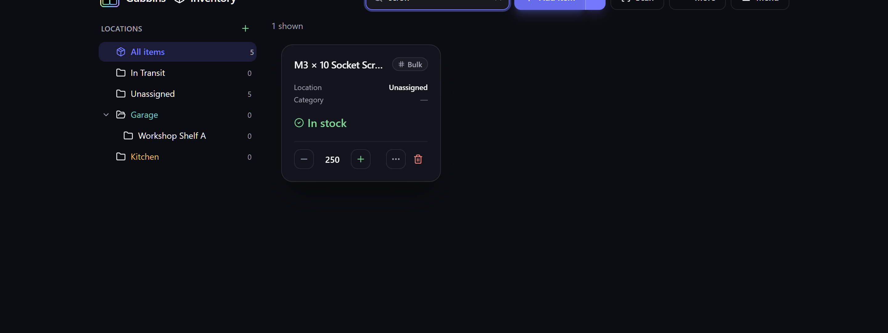

# Search overview

Gubbins is built to find things fast. However big your inventory gets, there are four ways to
narrow it down — from a quick type-ahead to a precise, saveable query.

**Where to find it:** the **Search items** box at the top of the **Inventory** screen (and the
[[command palette|Command-Palette-and-Shortcuts]] from anywhere).

## Quick search

Just start typing in the **Search items** box. Gubbins matches across your items' names and
details as you type, powered by a fast full-text index:

- **Prefix matching** — typing `screw` finds *screws* and *screwdriver*.
- **Every word narrows** — `blue m3` finds only the items matching both words.
- **Across the details** — names, descriptions, notes, MPNs, manufacturers, barcodes and serial
  numbers are all indexed.

> **💡 Tip**
> Press **Escape** in the search box to clear it without reaching for the mouse.

> **⚠️ Heads-up**
> Matching works from the *start* of each word, so a typo won't find it and a longer form won't
> match a shorter one (`drills` does not find *drill*). Trim back to the shortest beginning you're
> sure of — `dril` finds both.

The **bookmark** button at the right-hand end of the box opens your
**[[saved searches|Saved-Searches-and-Favourites]]** — keep the search you've just typed, or bring
back one you saved earlier, without opening any other panel.

## Four ways to search

| Way | Best for | Page |
| --- | --- | --- |
| **Quick search** | Finding something by name, fast | *(this page)* |
| **Plain English** | A natural request without learning any syntax | [[Natural-language search\|Natural-Language-Search]] |
| **Text syntax** | Power users who want precise `field:value` control | [[Text query syntax\|Text-Query-Syntax]] |
| **Visual builder** | Building complex AND/OR queries by clicking | [[Visual query builder\|Visual-Query-Builder]] |

The last three all live in the **Visual search** panel (open it from the **More** menu on the
Inventory screen) and all do the same thing under the hood — they build up a filter you can
refine, re-run and **[[save|Saved-Searches-and-Favourites]]**. Saved searches are reachable from
both places: the **Visual search** panel and the quick-search box's bookmark button.

## Choosing an item in a picker

Plenty of screens ask you to *pick an item* rather than search for one: a kit component, a BOM
line, a purchase-order line, a related item, a substitute, or the single item an export covers.
Every one of those pickers searches your whole catalogue.

Click the box and it offers a first few items to choose from. Start typing and it searches
instead, exactly as the quick-search box does — so an item is reachable however far down the
alphabet it sits, and however many items you hold.

- **The closest matches come first.** The list is ranked by how well each item matches what you
  typed, over every item that matched — not the first handful in alphabetical order.
- **It tells you what it isn't showing.** Under the box, a line such as *"Showing the closest 20
  of 143 matches — keep typing to narrow"* means there is more behind it. Add another word.
- **Two items with the same name stay distinct.** The second and later ones are shown with a short
  identifier in brackets, so you can tell which is which.
- **`↑` / `↓` and `Enter`** choose from the list, and **`Escape`** closes it without clearing what
  you typed.

> **ℹ️ Note**
> Projects are picked the same way, on the [[export|Export-and-Import]] screen.

## Filtering alongside search

Search combines with the other ways to narrow the list:

- **Location** — selecting a location in the tree limits results to that place. See
  [[Locations & stock|Locations-and-Stock]].
- **Status chips** — quick filters for things needing attention (low stock, expiring, overdue,
  maintenance due). See [[Alerts|Alerts]].
- **Category and tag facets** — narrow to a category or [[tag|Tags-Attachments-and-Related-Items]].
  The **Category** picker lists only categories that are actually in use in the current view, so a
  category with no items simply doesn't appear — and it drops out (or comes back) live as you move
  items between categories, without a reload.

> **ℹ️ Note**
> When the **Visual search** panel is driving the results, it takes over from the quick-search
> box, the status chips and the category/tag facets — so you're always looking at exactly one
> query's results, never a confusing mix. The **location** selected in the sidebar is the
> exception: it still scopes the query, and the result line names it. See
> [[Visual query builder|Visual-Query-Builder]].

## How many matched

Directly above the list, Gubbins tells you how many items your current search and filters match
— for example **“128 items match”**. That figure is the *total* across everything that matched,
not just the rows currently on screen, so it stays put as you scroll and only changes when you
actually change a filter. It reads the same when the list is [[grouped by location|Inventory-Views]]
or driven by the **Visual search** panel.

Because it's announced as a live status, screen-reader users hear the new total each time a
filter changes — the quickest way to tell whether a query narrowed too far, or matched nothing
at all.

## Related pages

- **[[Capabilities|Custom-Fields-and-Capabilities]]** — searchable, weighted attributes with
  best-match ranking.
- **[[Saved searches & favourites|Saved-Searches-and-Favourites]]** — keep and recall queries.
