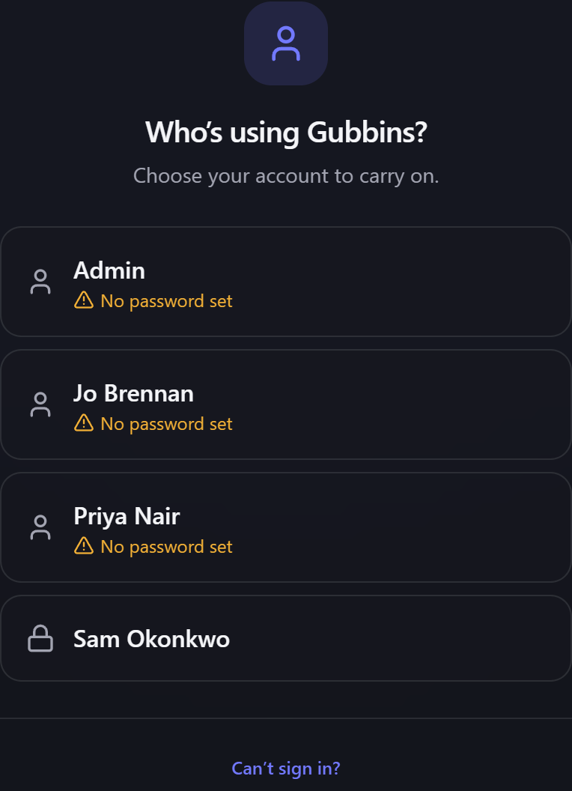

# Signing in

With the **Users** module switched on, Gubbins asks who you are before it opens, and then keeps you
to whatever your [[role|Roles-and-Permissions]] allows. This page covers what that looks like, and
how to get back in if it goes wrong.

**Where to find it:** it appears by itself when you open Gubbins, once the Users module is on. Sign
*out* from the main menu.

## Turning sign-in on

Sign-in comes with the **Users** module, switched on from [[Modules|Modular-UI]]. Because switching
it on immediately puts a door in front of the app, Gubbins checks first that somebody can still get
through it:

- If **no account can sign in**, it refuses and tells you to add one — rather than locking you out.
- If at least one account has **no password**, it names that account, so you know your way back in.
- If **every** account has a password, it lists them and asks you to be sure you know one.

The confirmation also spells out what you're turning on: you'll be asked to sign in each time
Gubbins opens on this device, every change gets recorded against whoever made it, and you can switch
it back off at any time without losing anything.

## Signing in

Pick your tile, and enter your password if the account has one. Accounts with no password sign in
with a tap, and are labelled **No password set** so nobody is misled about it.

An account whose sign-in has been turned off is labelled as such on its tile. Selecting it explains
why, using whatever message the person who administers this device left — *"On leave until August"*,
say — or a general note if they didn't leave one.

> **ℹ️ Note**
> Sign-in is **per device**. Staying signed in on your own machine has no effect on the workshop
> tablet, and signing out on one doesn't sign you out on the other.

## Signing out

**Sign out** sits in the main menu, showing who's currently signed in. Signing out returns you to the
tiles.

## What a password actually protects

This is worth being plain about, because it would be easy to assume more.

- ✅ It **controls who gets into the app** on this device.
- ✅ It **puts a name against every change**, so the [[activity log|Activity-Log]] says who.
- ❌ It **does not encrypt your data.** Anyone who can reach this device's files can read your whole
  inventory regardless of any password you set.

> **⚠️ Heads-up**
> Sign-in is a boundary between the people who share a device, not a defence against someone who has
> the device. If you need the data itself protected, use your device's passcode or disk encryption —
> Gubbins can't substitute for either. See [[Privacy & security|Privacy-and-Security]].

## Can't sign in?

Because the [[Modules|Modular-UI]] screen — the only way to switch sign-in off — sits behind the
sign-in screen itself, a forgotten password would otherwise be a dead end. So the sign-in screen
carries a **Can't sign in?** escape hatch that switches the Users module off **on this device** and
puts you straight back to your data.

Nothing is deleted: every account, role and record of who changed what is kept, and comes back the
moment you switch sign-in on again.

> **ℹ️ Note**
> This doesn't weaken anything that was ever true. As above, a password controls who gets into the
> app rather than whether the data is encrypted — anyone holding this device could read the files
> without going near the app.

## Related pages

- **[[Users & accounts|Users-and-Accounts]]** — creating accounts and setting passwords.
- **[[Roles & permissions|Roles-and-Permissions]]** — what each person may do once signed in.
- **[[Modular UI|Modular-UI]]** — switching the Users module on and off.
- **[[Privacy & security|Privacy-and-Security]]** — the full picture of what's protected.
