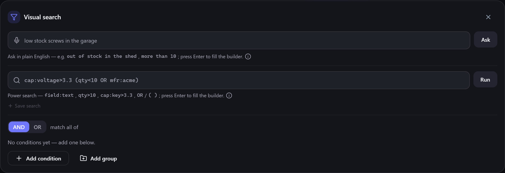

# Text query syntax

The **power search** box accepts a compact text syntax for precise filtering — ideal if you'd
rather type `qty<10 mfr:acme` than click through the [[visual builder|Visual-Query-Builder]].
Pressing **Enter** runs it (and fills the builder, so you can fine-tune afterwards).

**Where to find it:** the second box in the **Visual search** panel (Inventory → **More** →
**Visual search**).



## The basics

A query is a list of terms separated by spaces. A bare word matches item **names**:

```
esp32
```

Add a `field:` prefix to search a specific field:

```
mfr:acme          items whose manufacturer contains "acme"
name:bracket      items whose name contains "bracket"
```

Field names are **case-insensitive** and accept short aliases.

## Fields you can search

| Field | Aliases | Matches |
| --- | --- | --- |
| Name | `name` | The item name |
| Description | `description`, `desc` | The description |
| Notes | `notes`, `note` | Free-text notes |
| Manufacturer | `manufacturer`, `mfr`, `make` | The maker |
| Part number | `mpn` | Manufacturer part number |
| Barcode | `barcode`, `gtin`, `upc`, `ean` | A scanned/entered barcode |
| Serial number | `serial`, `serialnumber`, `sn` | The unit's serial number |
| Quantity | `quantity`, `qty` | On-hand count *(numeric)* |
| Weight | `weight` | Item weight *(numeric)* |
| Dimensions | `width`, `height`, `depth` | Bounding size *(numeric)* |
| Favourite | `favourite`, `favorite`, `fav` | Pinned favourites *(yes/no)* |

## Comparisons

Numeric fields accept `>`, `<` and `=`:

```
qty<10            fewer than 10 in stock
qty=0             out of stock
weight>500        heavier than 500 g
```

The favourite flag is a yes/no:

```
fav:yes           only your favourites
```

## Capabilities

[[Capabilities|Custom-Fields-and-Capabilities]] are weighted attributes you define. Use the
`cap:` prefix:

```
cap:waterproof            items that have the "waterproof" capability
cap:voltage>3.3           capability "voltage" greater than 3.3
cap:colour=red            capability "colour" equal to "red"
```

Custom category fields work the same way with `field:` (or `cf:`):

```
field:material=steel
```

## Is it filled in at all?

Use `has:` to find items that carry *any* value for a field — and, with the `-` below, the ones
that don't:

```
has:mpn                   items that have a part number
has:Datasheet             items with a value for the "Datasheet" custom field
-has:category             items you haven't put in a category yet
```

`has:` takes the optional fields — description, notes, MPN, manufacturer, barcode, serial number,
weight, dimensions and `category` — under the same aliases as the table above. A name it doesn't
recognise is read as one of your own [[custom fields|Custom-Fields-and-Capabilities]]. Asking about
something every item always has (`has:name`, `has:qty`, `has:location`) is rejected rather than
answered, since it would match everything.

## Excluding things

Put `-` (or `NOT`) in front of a term to exclude what it matches:

```
resistor -mfr:acme        resistors, but not the ones made by Acme
-mpn=LM7805               everything except that exact part number
-has:Datasheet            items with no datasheet on file
-(qty<10 OR fav:yes)      neither low-stock nor favourited
```

`-` applies to the **one** term or bracket immediately after it, so `-mfr:acme resistor` means
*"not Acme"* **and** *"resistor"*. It is also how you write "not equal to" — there's no `!=`.

> **💡 Tip**
> Excluding a field also keeps the items that have **nothing** in it. `-mfr:acme` returns items
> with no manufacturer recorded as well as items made by someone else — which is almost always
> what you meant.

## Combining terms

- **Spaces mean AND** — every term must match: `qty<10 mfr:acme`.
- **`OR`** — either side: `mfr:acme OR mfr:globex`.
- **Parentheses** group logic: `cap:voltage>3.3 (qty<10 OR mfr:acme)`.
- **`-` / `NOT`** exclude, and bind tightest of the three.

> **💡 Tip**
> A value containing a bracket, a `|`, or a leading `-` must be quoted so it isn't read as
> structure — for example `name:"a|b"` or `"-40C"`. A hyphen *inside* a term is always literal, so
> `mpn:ABC-123` needs no quoting.

> **ℹ️ Note**
> If a term can't be understood, Gubbins tells you why rather than silently ignoring it — so a
> typo'd field name is easy to spot and fix.

## Related pages

- **[[Visual query builder|Visual-Query-Builder]]** — the same queries, built by clicking.
- **[[Natural-language search|Natural-Language-Search]]** — no syntax to learn at all.
- **[[Saved searches & favourites|Saved-Searches-and-Favourites]]** — keep a query for reuse.
