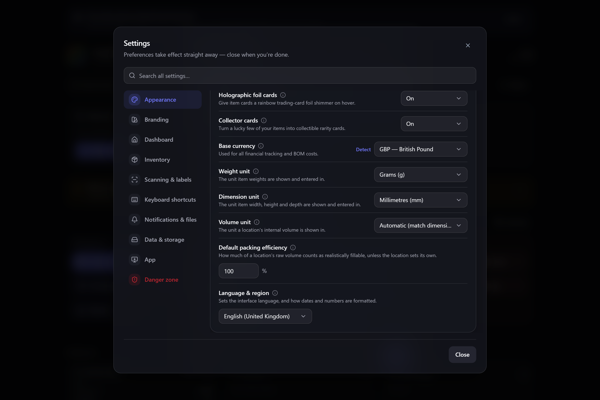

# Units of measure

Gubbins records what things **weigh** and how **big** they are, and lets you read those figures in
whichever units you actually think in — grams or pounds, millimetres or inches. The measurement
itself is stored independently of your choice, so switching units re-displays your data rather
than changing it.

**Where to find it:** **Settings → Appearance** — the **Weight unit**, **Dimension unit** and
**Volume unit** rows, just below **Base currency**.

## Weight unit

The unit every item **weight** is shown and entered in:

| Choice | Shown as |
| --- | --- |
| **Grams** *(default)* | `250 g` |
| **Kilograms** | `0.25 kg` |
| **Ounces** | `8.818 oz` |
| **Pounds** | `0.551 lb` |

It applies wherever a weight appears: the **weight** field on an item's **Details** tab, the
readings you type into [[counting by weight|Counting-by-Weight]], and the tares saved in your
[[container weights|Container-Weights]] library.

## Dimension unit

The unit **widths, heights and depths** are shown and entered in — **millimetres** (the default),
**centimetres**, **metres**, **inches** or **feet**.

It applies to an item's own size on its **Details** tab, and to the internal size of a
[[location|Locations-and-Stock]] — the measurements Gubbins turns into a usable volume.

## Volume unit

A location's volume is *derived* from its width × height × depth, so it gets a unit of its own.
Left on **Automatic** — the default — Gubbins picks a readable scale for each value from your
dimension unit: a drawer reads in litres, a whole storage bay in cubic metres, and an imperial
setup gets cubic inches and cubic feet. Pick **Litres**, **Cubic centimetres**, **Cubic metres**,
**Cubic millimetres**, **Cubic inches** or **Cubic feet** instead to show every volume in one unit.

> **💡 Tip**
> Automatic is worth keeping unless you have a reason not to. Pin everything to cubic metres and a
> small parts drawer rounds away to `0 m³`; pin it to cubic centimetres and a whole storage bay
> runs into the millions.

## Changing a unit never changes your data

Weights are stored in one canonical unit and dimensions in another, whatever you have these set
to. Switching from grams to pounds re-expresses the same stored weight — nothing is converted,
rounded or lost, and switching back gives you exactly the figure you started with.

The same is true of anything already typed in: a part recorded as `500 g` shows as `1.102 lb` the
moment you switch, and an item you then enter as `2 lb` is stored so that it reads `907.185 g` if
you switch back.

> **ℹ️ Note**
> These three units live in the **Language, units & currency** group, so they travel with your
> other preferences if you have [[settings sharing|Sharing-Settings-Between-Devices]] switched on
> — and are carried by a [[backup|Backup-and-Restore]]. Leave that group unticked on a device
> that should keep its own units.

## Where units are fixed

A few places deliberately use the canonical units rather than your display choice, because the
value is being handled as raw data rather than read off a screen:

- **Searching.** The [[visual query builder|Visual-Query-Builder]] labels its fields *Weight (g)*
  and *Width (mm)*, and the same is true of the [[text syntax|Text-Query-Syntax]] — `weight>500`
  means heavier than 500 grams however you read weights.
- **Exporting and importing.** A `weight` column is in grams and `width` / `height` / `depth` in
  millimetres, in both directions — see [[export & import|Export-and-Import]]. That keeps a file
  exported on one device meaningful on another with different settings.
- **A pasted list of items.** Importing free-form lines (one item per line), a labelled weight
  *does* accept a unit — `w:2.5kg`, `weight:16oz` — while a bare number like `w:500` is read as
  grams.
- **The [[bridge|Bridge-Overview]].** A filter on `weight` or `width` / `height` / `depth`
  compares in grams and millimetres, so an integration reads the same figures whatever this device
  is set to.
- **Printed labels.** Label and page sizes are always given in millimetres — see
  [[QR codes & label printing|QR-Codes-and-Label-Printing]].
- **A location's usable volume.** The optional override under a location's **Advanced space
  options** is typed in **litres** — or **cubic feet** if your dimension unit is imperial —
  whatever the volume unit above is set to.

> **ℹ️ Note**
> A [[consumable gauge|Low-Stock-and-Gauges]] carries its **own** unit of measure, chosen per item
> — a reel in metres, a bottle in millilitres, a spool in grams. That is part of the item, not a
> display preference, so these settings don't affect it.

## Related pages

- **[[Items]]** — where an item's weight and dimensions are recorded.
- **[[Locations & stock|Locations-and-Stock]]** — location sizes, derived volume and the fullness
  gauge that uses them.
- **[[Counting by weight|Counting-by-Weight]]** — counting small parts from a recorded unit weight.
- **[[Container weights|Container-Weights]]** — saved tares for trays, jars and spools.
- **[[Language & region|Language-and-Region]]** — language, number and date formatting, and your
  base currency.
- **[[Appearance & theming|Appearance-and-Theming]]** — the rest of the Appearance settings.
