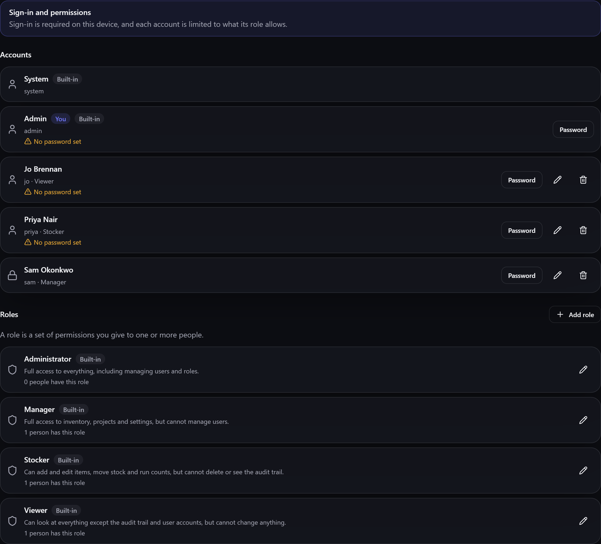

# Users & accounts

If more than one person uses the same copy of Gubbins, **accounts** let you say who they are, put a
name against every change they make, and limit what each of them may do. It's entirely **optional**
— Gubbins works exactly as it always has until you switch it on.

**Where to find it:** the **Users** screen, once the **Users** module is switched on in
[[Modules|Modular-UI]]. Switching that module on is what turns [[sign-in|Signing-In]] on too — the
two are the same choice.

## What an account is for

An account does two things:

- **Attribution.** Every change is recorded against the person who made it, so the
  [[activity log|Activity-Log]] answers *who* as well as *what* and *when*.
- **Permissions.** Each account holds a [[role|Roles-and-Permissions]], and the role decides which
  parts of Gubbins that person may see and change.

An account is also what an outside tool acts *as*: if you run the [[bridge|Bridge-Overview]], each
integration presents an [[API token|Bridge-API-Tokens]] minted against an account and is held to
that account's role.

> **ℹ️ Note**
> An account is **not** the same as a [[contact|Contacts]]. A contact is a person recorded as *data*
> — someone you lend a drill to. An account is someone who *uses Gubbins*. They're kept separately,
> and one person can be both.

## The two built-in accounts

Every copy of Gubbins starts with two accounts you can't delete:

- **Admin** — full access to everything. This is who Gubbins acts as when the Users module is off,
  which is why nothing changes for a single-person setup.
- **System** — not a person. It's the name Gubbins puts against things it does itself: tidy-up
  jobs, [[sync|Cloud-Sync]] reconciliation, scheduled imports. It never signs in and has no
  sign-in tile.

## Adding someone

**Add user** asks for:

| Field | What it's for |
| --- | --- |
| **Username** | The handle they sign in with. Unique on this device, ignoring case in any language — `josé` and `JOSÉ` are one account, and signing in either way reaches it |
| **Display name** | What's shown around the app and against everything they change |
| **Email** | Optional |
| **Description** | Optional. A short note on what the account is for, shown on its row |
| **[[Role\|Roles-and-Permissions]]** | What they may do. Without one they can sign in, but nothing else |
| **This account may sign in** | Untick to suspend an account without deleting it |

When sign-in is turned off for an account you can add a short **message shown when they try to sign
in**, so a refusal isn't a mystery — *"On leave until August"* is more use than a blank wall.

## Passwords are optional

A password on an account is a choice, not a requirement. Leaving one off is perfectly reasonable on
a shared family or workshop device where the point is knowing **who did what**, not keeping anyone
out. Accounts without one are marked plainly, both in this list and on the
[[sign-in screen|Signing-In]], so it's never a surprise.

> **⚠️ Heads-up**
> **A password does not encrypt your data.** It controls who gets into the *app* on this device and
> puts a name against each change. Anyone who can reach this device's files can still read your
> inventory, whatever passwords you set. If you need more than that, use your device's own passcode
> or disk encryption — see [[Privacy & security|Privacy-and-Security]].

## Deleting an account

Deleting an account stops that person signing in. It does **not** erase what they did: their entries
stay in your [[activity log|Activity-Log]] and are shown against the built-in **System** account
instead, so the record of what happened to your inventory stays complete.

## Turning it all off again

Switching the Users module back off in [[Modules|Modular-UI]] **loses nothing**. Every account, every
role and every record of who changed what is kept exactly as it is — Gubbins simply stops asking
anyone to sign in and goes back to acting as **Admin**. Switch it on again and everyone's account and
role are exactly as they were.

> **💡 Tip**
> You can still reach the Users screen with the module off, to read and tidy accounts before
> switching sign-in back on. Going to it shows the usual "this module is hidden" page first —
> choose **Continue anyway** to open it *without* turning sign-in on. The screen says plainly that
> nothing is being enforced.

## Related pages

- **[[Signing in|Signing-In]]** — what people see once sign-in is on, and how to get back in.
- **[[Roles & permissions|Roles-and-Permissions]]** — deciding what each account may do.
- **[[Activity log|Activity-Log]]** — where attribution shows up.
- **[[Bridge API tokens|Bridge-API-Tokens]]** — letting an outside tool act as one of these
  accounts.
- **[[Modular UI|Modular-UI]]** — switching the Users module on and off.
- **[[Privacy & security|Privacy-and-Security]]** — what accounts do and don't protect.
