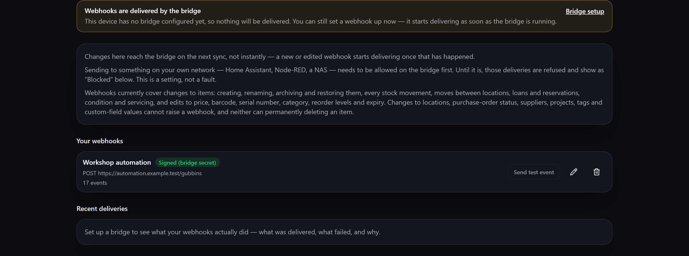
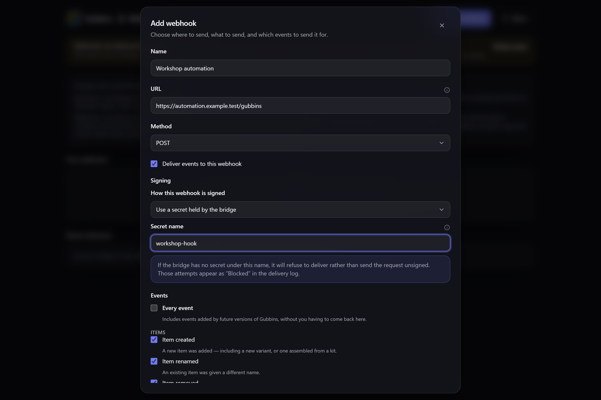

# Webhooks

Have Gubbins call a URL of your choosing when something changes — so Home Assistant, Node-RED,
Discord, or anything else that accepts an HTTP request can react to your inventory.

**Where to find it:** the **Webhooks** page in the main navigation.

## Before you start: the bridge does the delivering

Gubbins itself never calls your endpoint. Your browser can't reliably reach the addresses most
receivers actually live on — a Home Assistant box on your own network, a plain `http://` automation
server — so the [[bridge|Running-the-Bridge]] makes the call instead.

That means **webhooks need a running bridge**. You can still set one up before you have one: it
simply starts delivering as soon as the bridge is up.

> **ℹ️ Note — changes reach the bridge on the next sync**
> The bridge reads your webhooks out of the data it syncs, so a new or edited webhook starts
> delivering after your next sync reaches it, not the instant you press Save.

## Setting one up

Press **Add webhook** and fill in:

- **Name** — how you'll recognise it in the list. Purely for you.
- **URL** — the address the bridge calls. Must start with `http://` or `https://`.
- **Method** — `POST`, `GET`, `PUT` or `PATCH`. `POST` is what most receivers expect.
- **Events** — tick the changes you care about, grouped by kind (lifecycle, stock, movement,
  custody, upkeep). **Every event** also picks up any events added by future versions of Gubbins.
- **Filter** *(optional)* — narrow it further to a particular location, category, tag, specific
  items, or a quantity threshold.
- **Payload** *(optional)* — send Gubbins' standard event, a preset shaped for Discord, Slack or
  Home Assistant, or write your own using `{{item.name}}`-style placeholders. A preview shows what
  a real event would produce.
- **Extra headers** *(optional)* — for receivers that expect a particular header.

> **💡 Tip**
> Start with **Every event** and no filter to confirm the plumbing works end to end, then narrow it
> down once you're seeing deliveries.

## Signing: proving the request came from you

A signature lets your receiver confirm a request really came from Gubbins rather than from anything
else that happened to learn the URL. There are two ways to hold the signing secret, and the choice
matters.

**Use a secret held by the bridge (recommended).** You give the webhook the *name* of a secret you
have configured on your bridge. Only that name is stored in Gubbins — the secret value itself
**never enters your database, your synced data, or a backup**.

**Store a secret with this webhook.** Zero setup: Gubbins generates one for you. It is shown
**once**, with a copy button, and can only be replaced afterwards, never re-read.

> **⚠️ Heads-up — a stored secret travels with your data**
> A secret stored on the webhook is carried, in readable form, in your synced data and in every
> backup — which for [[cloud sync|Cloud-Sync]] means it sits wherever your sync folder lives. If
> that matters to you, use a secret held by the bridge instead.

You can also choose **not to sign**. That's fine for a private endpoint you trust, and a poor idea
for anything reachable from the internet.

> **ℹ️ Note — a missing secret stops delivery, it doesn't downgrade it**
> If you name a bridge-held secret the bridge can't find, that webhook is **dropped rather than sent
> unsigned**, and shows as **Blocked** in the delivery log. Gubbins will never quietly send an
> unsigned request in place of a signed one you asked for.

> **ℹ️ Note — `GET` cannot be signed**
> A `GET` request carries its data in the address itself, so there is no body to sign. Pick another
> method if you need a signature.

## What can — and can't — fire a webhook

Webhooks currently cover **changes to items**:

- creating, renaming, archiving and restoring an item;
- every stock movement, including running low and running out;
- moves between locations;
- loans and reservations (checked out, checked in, reserved, reservation cleared);
- condition changes and logged maintenance;
- edits to an item's recorded details — price, barcode, serial number, manufacturer and part
  number, category, batch and lot numbers, reorder levels, expiry, acquisition and warranty dates,
  depreciation period, weight and dimensions.

These **cannot** raise a webhook at all: changes to [[locations|Locations-and-Stock]],
[[purchase-order status|Purchase-Orders]], [[suppliers|Suppliers]], [[projects|Projects-and-BOM]],
[[tags|Tags-Attachments-and-Related-Items]] and
[[custom-field values|Custom-Fields-and-Capabilities]] — and neither can permanently deleting an
item.

> **⚠️ Heads-up — a bulk change may report itself as skipped**
> When a great many changes land at once — a [[bulk import|Export-and-Import]], for instance —
> events beyond a safety cap are dropped and you get a single *"Events were skipped"* notification
> instead. Your data is unaffected; only the notifications were. Read a bulk change from the
> bridge's query API rather than from events.

There are two further events outside the everyday list, both off unless you choose them:

- **Item looked up** — announces that someone asked *"where is…"* and got an answer. It publishes
  what was searched for, so it also needs its own separate switch on the bridge.
- **Events were skipped** — the diagnostic above.

## Testing, and the delivery log

Each webhook has **Send test event**, which fires a synthetic event through the same filter,
payload and signing your real events use, then records the result — the fastest way to tell whether
a receiver is actually listening.

**Recent deliveries** at the foot of the screen shows what your webhooks really did, with each
attempt marked:

- **Delivered** — the receiver accepted it.
- **Failed** — the receiver was reached but didn't accept it, or couldn't be reached.
- **Blocked** — refused before anything was sent: either the address is on a private network the
  bridge hasn't been allowed to reach, or a named signing secret couldn't be found.
- **Skipped** — not attempted, because recent deliveries to that endpoint had been failing.

> **ℹ️ Note — the log updates only while you're looking at it**
> The delivery log is fetched from the bridge while the Webhooks page is open. Leave the page and it
> stops updating; come back and it catches up. Deliveries themselves carry on regardless — the log
> is a window onto the bridge, not the thing doing the work.

If the log says **webhooks are switched off on your bridge**, that's different from *"nothing
delivered yet"*: the bridge is running but its webhook delivery hasn't been enabled, so nothing is
being sent at all. Turn it on in the bridge's own configuration.

## Sending to something on your own network

Home Assistant, Node-RED, a NAS — a receiver on your own network is the *expected* case, but the
bridge won't reach a private or loopback address until its operator explicitly allows it. Until then
those deliveries are refused and appear as **Blocked**.

This is a setting, not a fault. Turning it on is described in the bridge's own configuration — see
[[Running the bridge|Running-the-Bridge]].

> **⚠️ Heads-up**
> A webhook sends your data outward, to an address you chose. Keep them pointed at destinations you
> trust, sign them where you can, and see [[Privacy & security|Privacy-and-Security]].

## Hiding the page

Webhooks is an optional module. If you don't use it, switch it off on the [[Modular UI|Modular-UI]]
screen and the page disappears from this device's navigation — your webhooks are kept, and the
bridge carries on delivering them.

## Related pages

- **[[Running the bridge|Running-the-Bridge]]** — getting the bridge going, and its configuration.
- **[[Bridge overview|Bridge-Overview]]** — what the bridge is and what else it can do.
- **[[Webhooks, MQTT & iCal|Webhooks-MQTT-and-iCal]]** — the live event stream, MQTT publishing and
  the calendar feed.
- **[[Home Assistant integration|Home-Assistant-Integration]]** — the richer route into Home
  Assistant.
- **[[Cloud sync|Cloud-Sync]]** — how your webhooks reach the bridge in the first place.
- **[[Privacy & security|Privacy-and-Security]]** — what leaves your device, and when.
</content>
</invoke>
