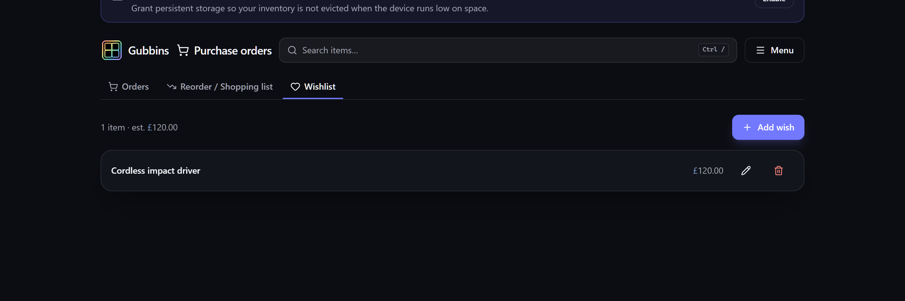

# Wishlist

A **wishlist** is a simple list of things you **want to buy but don't own yet** — the counterpart
to the stock-driven [[reorder list|Reorder-and-Shopping-List]]. Jot down a part you've got your
eye on, a tool you're saving for, or something to pick up next time.

**Where to find it:** the **Wishlist** tab on the **Purchase orders** screen.

## Adding to the wishlist

Each wishlist entry stands alone — it doesn't reference an existing item. Give it:

- A **name** for what you want.
- An optional **note**, **link** (to a product page), **target price**, and **priority**.

The list sorts by priority, so the things you want most sit at the top. Whatever its length, the
whole wishlist is loaded — so the summary line above it (how many wishes, and what they'd cost)
always covers everything on the list. If it grows long, turn on **Paginate list** (or
**Settings → Inventory → Lists**) to step through it a page at a time rather than scrolling — see
the [[pagination control|Inventory-Views]].

> **💡 Tip**
> Paste the product page **link** and a **target price** so, when you're ready to buy, everything
> you need is one click away — no hunting for where you saw it.

## Importing a list

Got a list already? **Import list** takes a pasted block or a file and adds every line to the
wishlist in one go — a spreadsheet, a **CSV / TSV**, **JSON**, a **Markdown** or **HTML** table, or
simply one thing per line. Where the list gives a price it becomes the entry's **target price**, a
link becomes its **link**, and a supplier is kept in the entry's note.

You'll see a preview of what will be added before anything is written. The same importer can send a
list to a [[purchase order|Purchase-Orders]] instead, if you're ready to actually order it.

> **⚠️ Heads-up**
> Only ordinary web links (`http`/`https`) are accepted for an entry's link, so a wishlist can't
> carry anything unsafe.

## Removing a wish

The bin on a row removes that wish, along with its note, link and target price. It can't be
undone and the removal reaches your other devices, so Gubbins names the wish and asks before it
removes anything.

> **ℹ️ Note**
> The wishlist is for things you **don't own**. Once you buy something and start tracking it, it
> becomes a normal [[item|Items]]; restocking things you *do* own is the
> [[reorder list|Reorder-and-Shopping-List]]'s job.

## Related pages

- **[[Reorder & shopping list|Reorder-and-Shopping-List]]** — restocking what you already own.
- **[[Purchase orders|Purchase-Orders]]** — ordering from a supplier.
